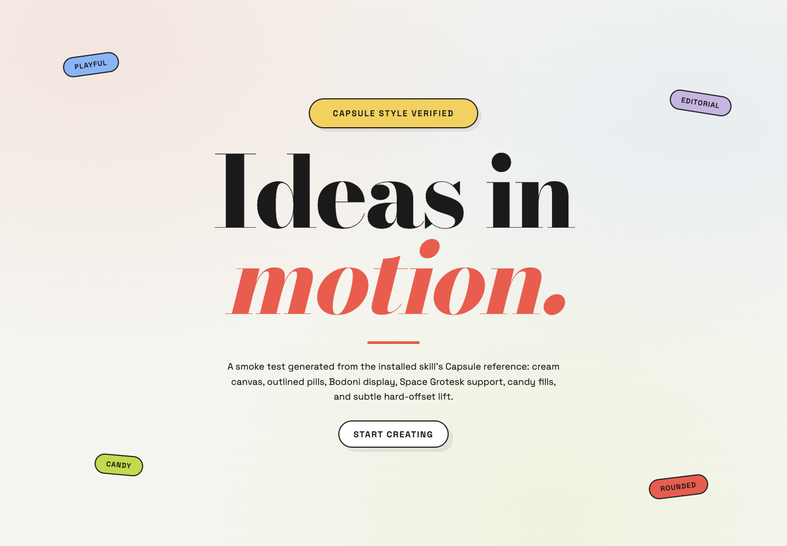

# Awosome Frontend Styles

A QoderWork skill for generating polished HTML and React interfaces from ten curated HyperFrames-inspired visual systems.

The skill treats every style as a design system rather than a mood board: exact palettes, typography roles, borders, shadows, geometry, composition patterns, and explicit anti-patterns are preserved during implementation.



## Included styles

| Style | Best suited for |
|---|---|
| Creative Mode | Creative portfolios and expressive product stories |
| BlockFrame | Maximalist candy neo-brutalism and energetic landing pages |
| Biennale Yellow | Exhibitions, cultural programs, and literary editorial |
| Blue Professional | Consulting, enterprise, finance, and executive dashboards |
| Bold Poster | Campaigns, launches, announcements, and magazine covers |
| Broadside | Manifestos, advocacy, and industrial editorial stories |
| Capsule | Lifestyle, beauty, fashion, wellness, and consumer products |
| Cartesian | Architecture, museums, premium editorial, and research narratives |
| Cobalt Grid | Technical reports, archives, datasets, and catalogues |
| Coral | Product launches, portfolios, event campaigns, and magazine stories |

## Capabilities

- Generates self-contained static HTML pages.
- Generates React pages and components that follow an existing project’s conventions.
- Uses an explicit style when requested.
- Recommends a style from the content, audience, and desired tone when none is specified.
- Supports constrained hybrids when explicitly requested.
- Requires desktop and mobile visual verification before delivery.
- Enforces accessibility basics and each style’s explicit Do/Don’t rules.

## Installation

Clone the repository into the QoderWork skills directory:

```bash
git clone https://github.com/MrMao007/awosome-frontend-styles.git ~/.qoderwork/skills/frontend-design-styles
```

Alternatively, clone it elsewhere and copy the skill directory:

```bash
git clone https://github.com/MrMao007/awosome-frontend-styles.git
cp -R awosome-frontend-styles ~/.qoderwork/skills/frontend-design-styles
```

Restart or reload QoderWork after installation. The skill should appear as `frontend-design-styles`.

## Usage examples

```text
Create a product landing page in Capsule style as a self-contained HTML file.
```

```text
Restyle this React dashboard using Blue Professional. Keep the existing component architecture.
```

```text
Build an exhibition microsite. Recommend the most suitable bundled style and explain the choice briefly.
```

```text
Create a Coral landing page, borrowing only Cobalt Grid’s pixel-stack chart atom.
```

## Repository structure

```text
.
├── SKILL.md
├── references/
│   ├── STYLE_INDEX.md
│   └── *-design-spec.md
├── examples/
│   ├── capsule-smoke.html
│   └── capsule-smoke.png
├── CONTRIBUTING.md
├── LICENSE
└── NOTICE.md
```

`SKILL.md` contains the execution workflow. `references/STYLE_INDEX.md` selects the primary style, while each `*-design-spec.md` file contains the detailed visual contract.

## Design philosophy

**Atoms sacred, composition free.** Keep each system’s palette, typography, geometry, border/shadow language, and constraints fixed while adapting the composition to the user’s content.

## Attribution

The design specifications are independently authored summaries derived from publicly accessible HyperFrames design reference pages. HyperFrames and the referenced style names belong to their respective owners. This repository is not affiliated with or endorsed by HyperFrames.

Font names and font files remain subject to their respective licenses. This repository does not redistribute font binaries.

## License

MIT. See [LICENSE](LICENSE) and [NOTICE.md](NOTICE.md).
