# Awosome Frontend Styles — 100+ Design Styles

A portable [Agent Skills](https://agentskills.io/) package for generating polished HTML and React interfaces from **110 selectable design styles**: ten curated HyperFrames-inspired systems plus 100 independent product-homepage-inspired presets.

It works with common coding agents that support `SKILL.md`, including Claude Code, Codex CLI, Cursor, GitHub Copilot, Gemini CLI, Windsurf/Devin, OpenCode, Qoder, and QoderWork.

The skill treats every style as a design system rather than a mood board: exact palettes, typography roles, borders, shadows, geometry, composition patterns, and explicit anti-patterns are preserved during implementation.

**110 English design specifications · 110 runnable HTML examples · 110 preview images · HTML + React · Automatic recommendations or explicit selection**

[Browse the searchable live gallery](https://mrmao007.github.io/awosome-frontend-styles/) · [Full style selection matrix](references/STYLE_INDEX.md) · [Machine-readable catalogue](styles.json)

Choose a named system such as Capsule or a product-inspired look such as Notion, Anthropic, Cursor, Vercel, Stripe or Apple. All 110 published example pages are in English. The 100 product-inspired examples share the same fictional NOVA brand, English copy, data and interactions so the visual differences are easy to compare. The skill still generates new pages in the user's requested language.

## Ten foundational styles

Each preview links to a live HTML example hosted on GitHub Pages.

<table>
  <tr>
    <td width="50%"><a href="https://mrmao007.github.io/awosome-frontend-styles/examples/biennale-yellow.html">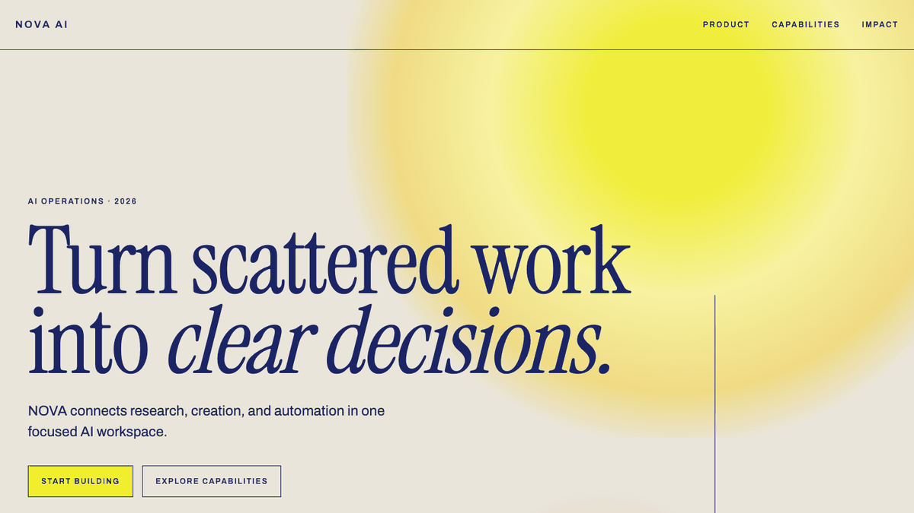</a><br><strong>Biennale Yellow</strong></td>
    <td width="50%"><a href="https://mrmao007.github.io/awosome-frontend-styles/examples/blockframe.html">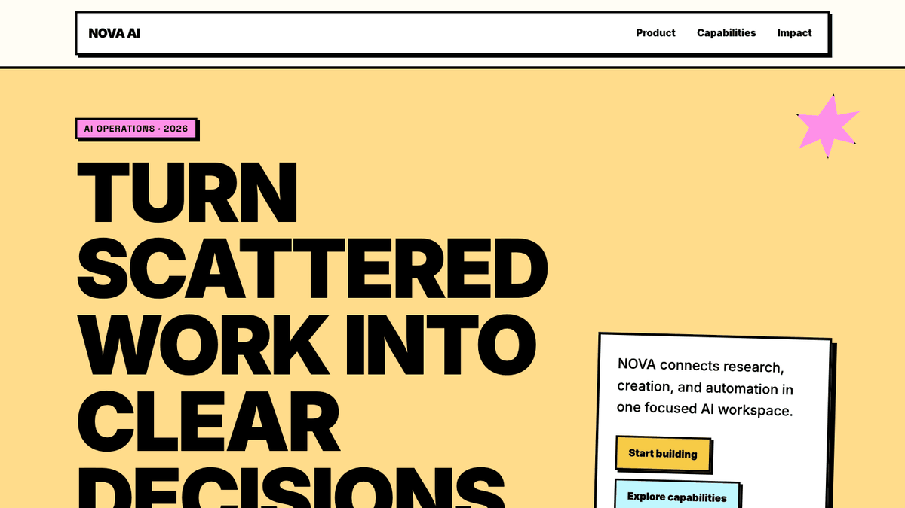</a><br><strong>BlockFrame</strong></td>
  </tr>
  <tr>
    <td><a href="https://mrmao007.github.io/awosome-frontend-styles/examples/blue-professional.html">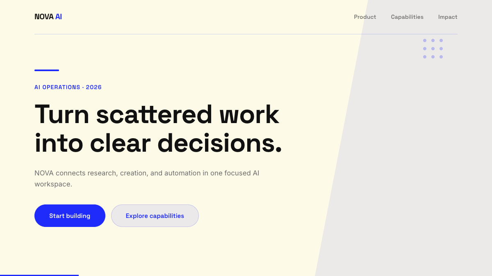</a><br><strong>Blue Professional</strong></td>
    <td><a href="https://mrmao007.github.io/awosome-frontend-styles/examples/bold-poster.html">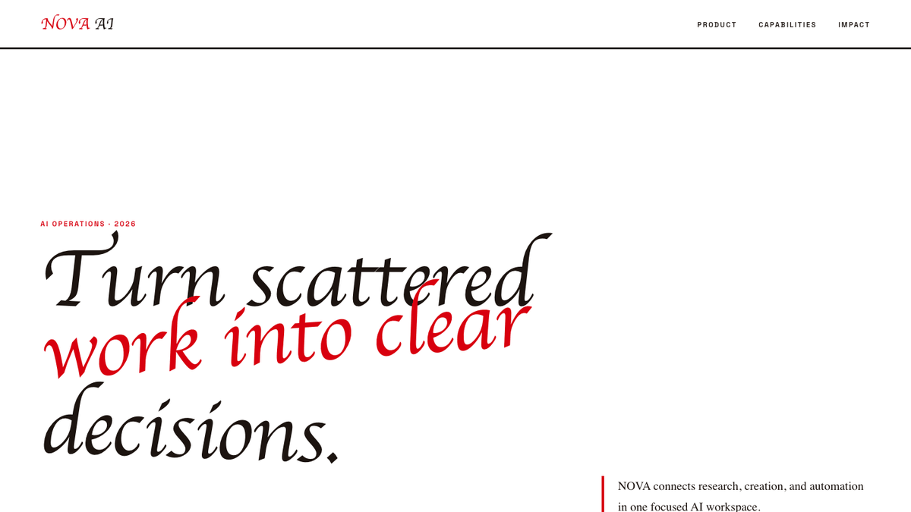</a><br><strong>Bold Poster</strong></td>
  </tr>
  <tr>
    <td><a href="https://mrmao007.github.io/awosome-frontend-styles/examples/broadside.html">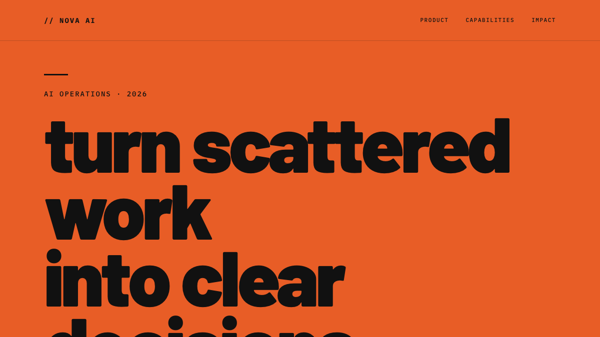</a><br><strong>Broadside</strong></td>
    <td><a href="https://mrmao007.github.io/awosome-frontend-styles/examples/capsule.html">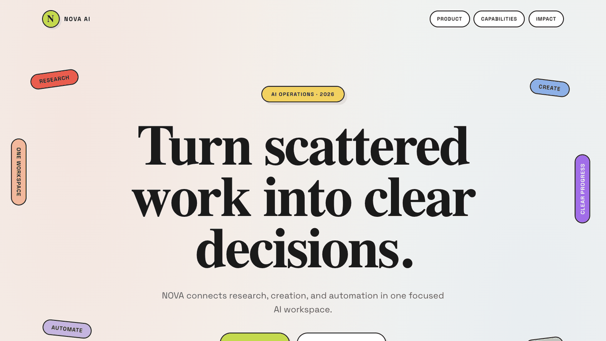</a><br><strong>Capsule</strong></td>
  </tr>
  <tr>
    <td><a href="https://mrmao007.github.io/awosome-frontend-styles/examples/cartesian.html">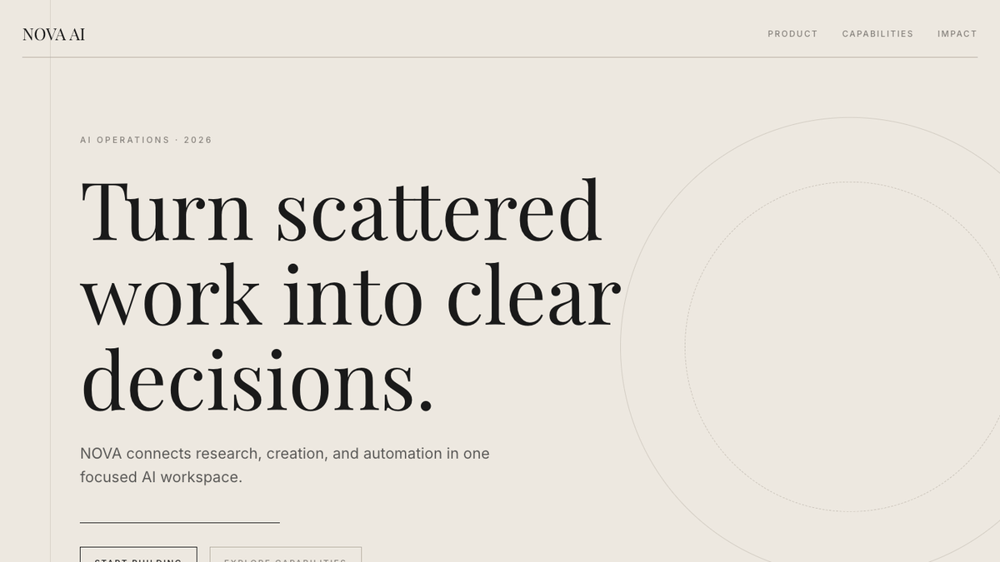</a><br><strong>Cartesian</strong></td>
    <td><a href="https://mrmao007.github.io/awosome-frontend-styles/examples/cobalt-grid.html">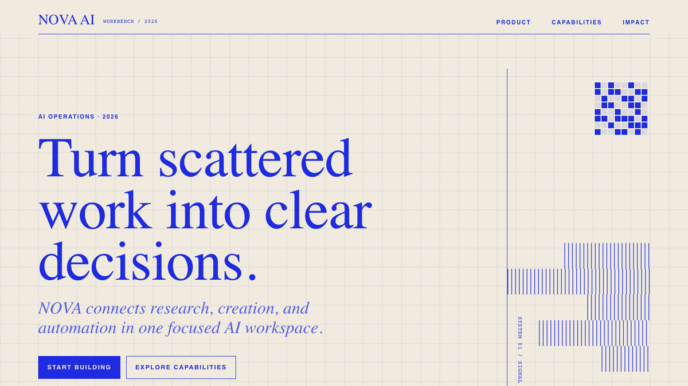</a><br><strong>Cobalt Grid</strong></td>
  </tr>
  <tr>
    <td><a href="https://mrmao007.github.io/awosome-frontend-styles/examples/coral.html">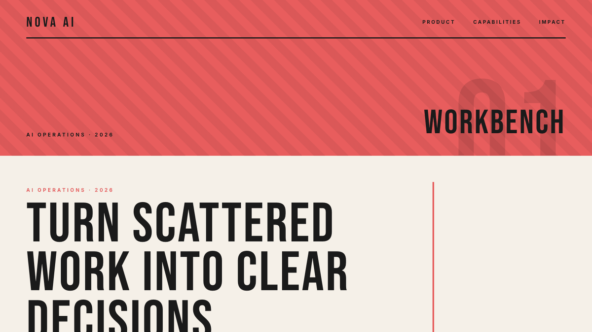</a><br><strong>Coral</strong></td>
    <td><a href="https://mrmao007.github.io/awosome-frontend-styles/examples/creative-mode.html">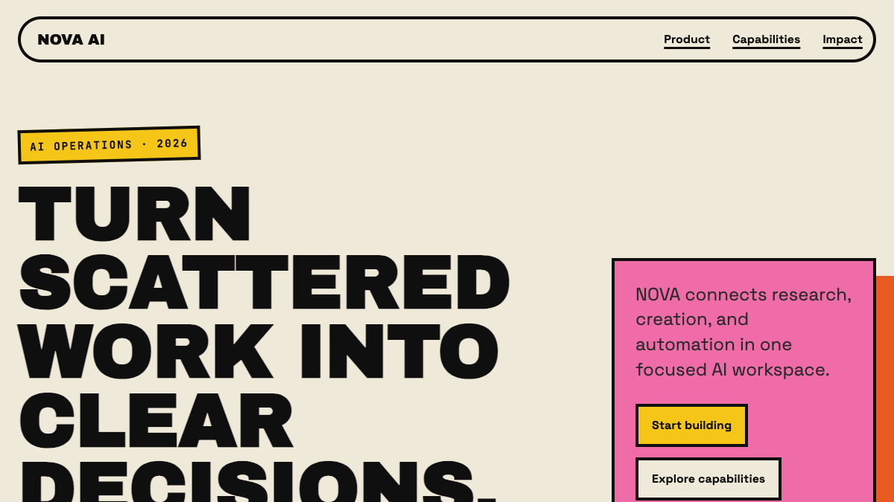</a><br><strong>Creative Mode</strong></td>
  </tr>
</table>

## 100 product-inspired styles

Each preset includes observed palette and typography, composition and component rules, source/adaptation boundaries, reusable signature atoms, Do/Don't rules and example implementation tokens. These are independent visual interpretations, not pixel clones or official brand manuals.

Examples use inline CSS/JavaScript and licensed web-font requests or system fallbacks. They bundle no font binaries or source-site screenshots. Previews show the original verified composition using available replacement fonts; web fonts may fall back when offline.

<details>
<summary>Work &amp; Collaboration — 18 styles</summary>

<table>
<tr><td width="38%"><a href="https://mrmao007.github.io/awosome-frontend-styles/examples/notion.html">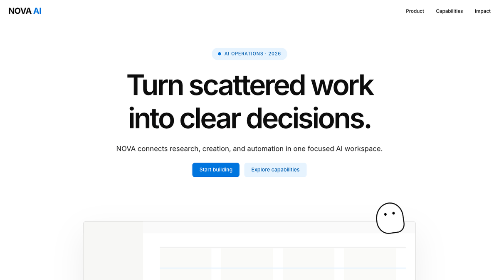</a></td><td><strong>Notion</strong><br>Oversized centered black typography, white space, pale-blue capsules, and a softly shadowed document canvas.<br><a href="references/notion-design-spec.md">English design spec</a> · <a href="https://mrmao007.github.io/awosome-frontend-styles/examples/notion.html">Live example</a></td></tr>
<tr><td width="38%"><a href="https://mrmao007.github.io/awosome-frontend-styles/examples/asana.html">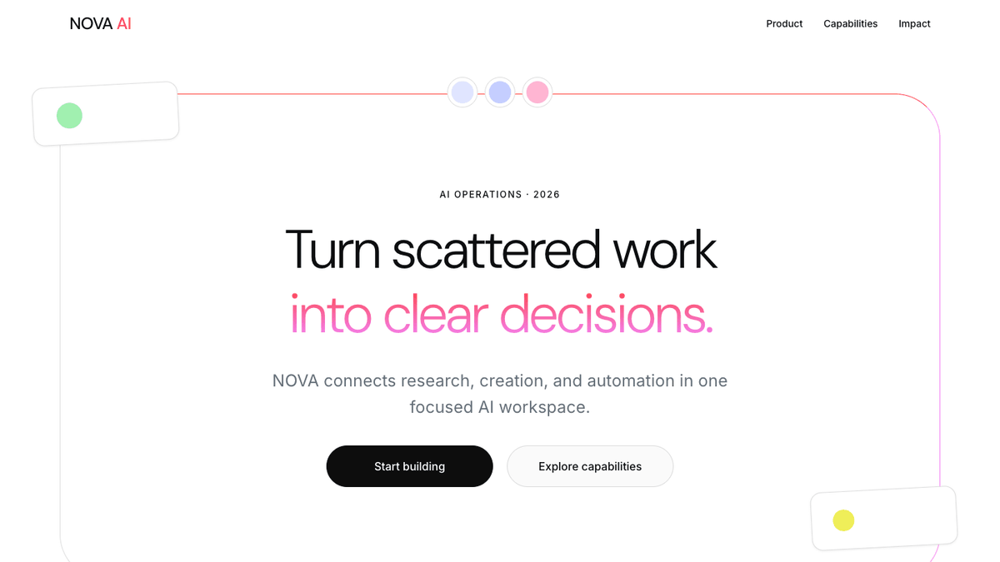</a></td><td><strong>Asana</strong><br>Airy lightweight centered type, coral-to-pink emphasis, black pill actions, and a fine rounded workflow enclosure.<br><a href="references/asana-design-spec.md">English design spec</a> · <a href="https://mrmao007.github.io/awosome-frontend-styles/examples/asana.html">Live example</a></td></tr>
<tr><td width="38%"><a href="https://mrmao007.github.io/awosome-frontend-styles/examples/monday.html">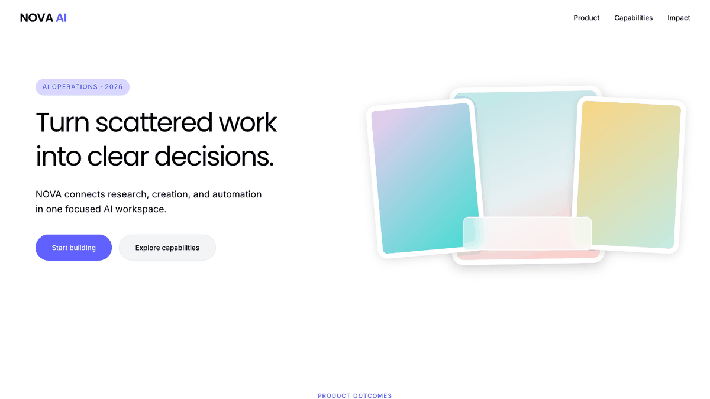</a></td><td><strong>monday.com</strong><br>Regular Poppins, left-aligned white hero, overlapping pastel cards, purple pills, and friendly color-coded sections.<br><a href="references/monday-design-spec.md">English design spec</a> · <a href="https://mrmao007.github.io/awosome-frontend-styles/examples/monday.html">Live example</a></td></tr>
<tr><td width="38%"><a href="https://mrmao007.github.io/awosome-frontend-styles/examples/clickup.html">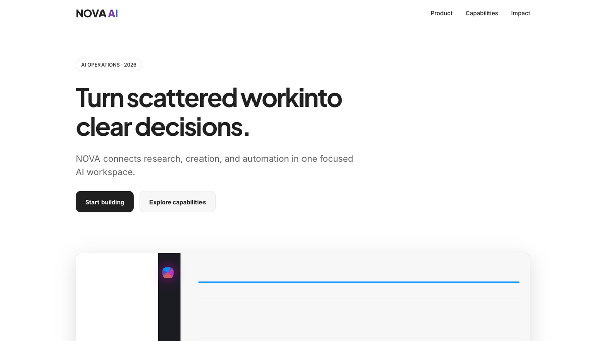</a></td><td><strong>ClickUp</strong><br>Bold left-aligned black type above a dense workspace preview, compact gray rows, and tiny rainbow accents.<br><a href="references/clickup-design-spec.md">English design spec</a> · <a href="https://mrmao007.github.io/awosome-frontend-styles/examples/clickup.html">Live example</a></td></tr>
<tr><td width="38%"><a href="https://mrmao007.github.io/awosome-frontend-styles/examples/airtable.html">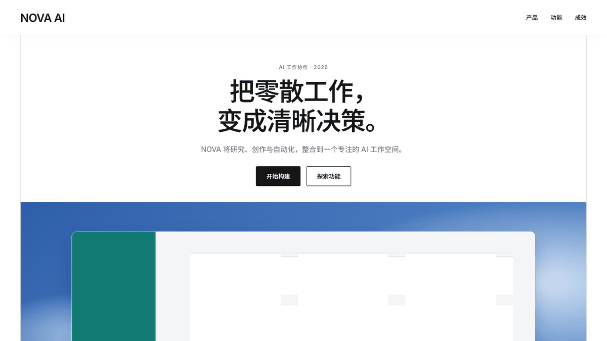</a></td><td><strong>Airtable</strong><br>Restrained centered type, nearly square black actions, fine page rails, and a blue-sky framed modular workflow canvas.<br><a href="references/airtable-design-spec.md">English design spec</a> · <a href="https://mrmao007.github.io/awosome-frontend-styles/examples/airtable.html">Live example</a></td></tr>
<tr><td width="38%"><a href="https://mrmao007.github.io/awosome-frontend-styles/examples/coda.html">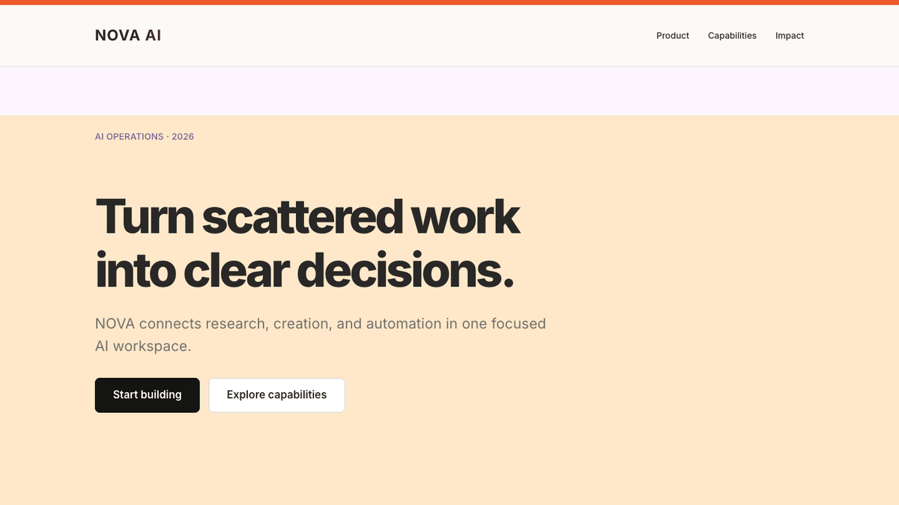</a></td><td><strong>Coda</strong><br>Warm document-like color blocks, lavender update strip, peach hero, bold left-aligned type, and black rectangular actions.<br><a href="references/coda-design-spec.md">English design spec</a> · <a href="https://mrmao007.github.io/awosome-frontend-styles/examples/coda.html">Live example</a></td></tr>
<tr><td width="38%"><a href="https://mrmao007.github.io/awosome-frontend-styles/examples/basecamp.html">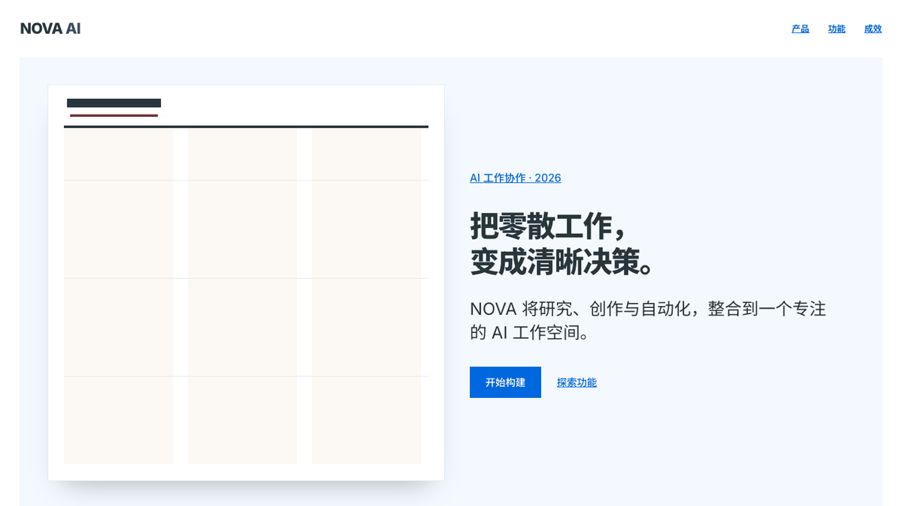</a></td><td><strong>Basecamp</strong><br>Product-first left visual, bold right-hand copy, blue underlined links, square actions, and pale-blue document panels.<br><a href="references/basecamp-design-spec.md">English design spec</a> · <a href="https://mrmao007.github.io/awosome-frontend-styles/examples/basecamp.html">Live example</a></td></tr>
<tr><td width="38%"><a href="https://mrmao007.github.io/awosome-frontend-styles/examples/todoist.html">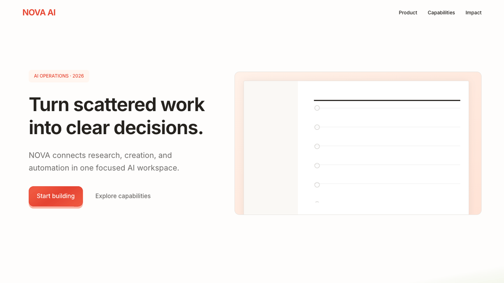</a></td><td><strong>Todoist</strong><br>Warm near-white split hero, modest type, coral lower-edge actions, peach task panel, and calm checklist rows.<br><a href="references/todoist-design-spec.md">English design spec</a> · <a href="https://mrmao007.github.io/awosome-frontend-styles/examples/todoist.html">Live example</a></td></tr>
<tr><td width="38%"><a href="https://mrmao007.github.io/awosome-frontend-styles/examples/craft.html">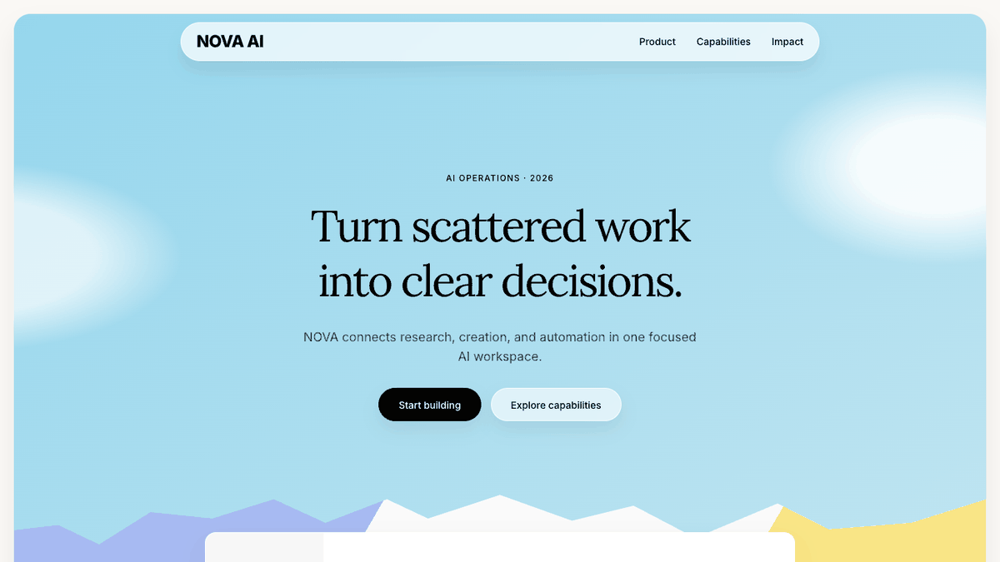</a></td><td><strong>Craft</strong><br>Inset sky-blue scene, floating translucent pill navigation, centered serif type, torn-paper collage, and soft document-library tiles.<br><a href="references/craft-design-spec.md">English design spec</a> · <a href="https://mrmao007.github.io/awosome-frontend-styles/examples/craft.html">Live example</a></td></tr>
<tr><td width="38%"><a href="https://mrmao007.github.io/awosome-frontend-styles/examples/obsidian.html">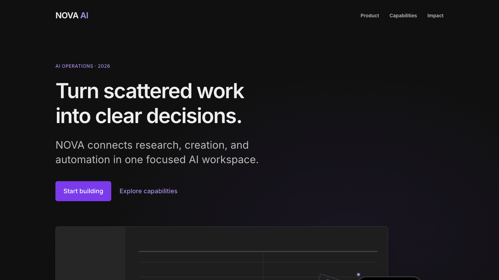</a></td><td><strong>Obsidian</strong><br>Quiet near-black knowledge surface, left-aligned sans-serif type, purple actions, gray document rails, and a subtle node graph.<br><a href="references/obsidian-design-spec.md">English design spec</a> · <a href="https://mrmao007.github.io/awosome-frontend-styles/examples/obsidian.html">Live example</a></td></tr>
<tr><td width="38%"><a href="https://mrmao007.github.io/awosome-frontend-styles/examples/loom.html">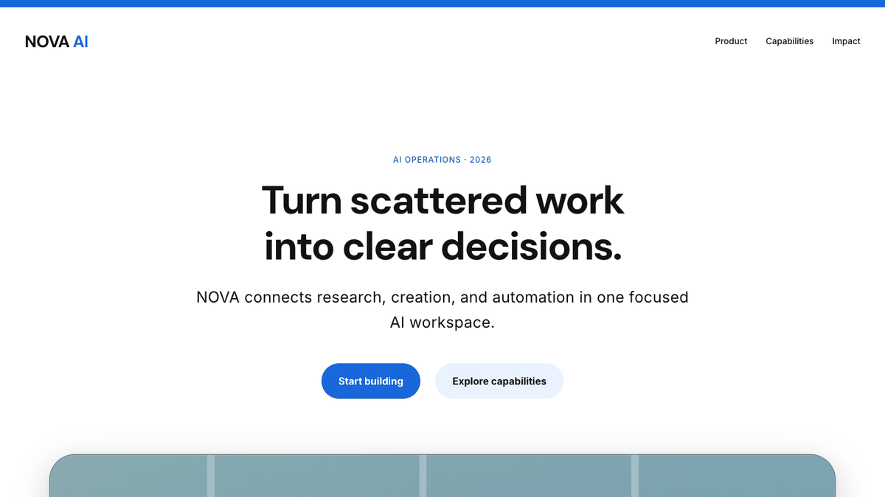</a></td><td><strong>Loom</strong><br>Centered bold type, spacious support copy, blue pill actions, large rounded media stage, and pale-blue feature panels.<br><a href="references/loom-design-spec.md">English design spec</a> · <a href="https://mrmao007.github.io/awosome-frontend-styles/examples/loom.html">Live example</a></td></tr>
<tr><td width="38%"><a href="https://mrmao007.github.io/awosome-frontend-styles/examples/cal.html">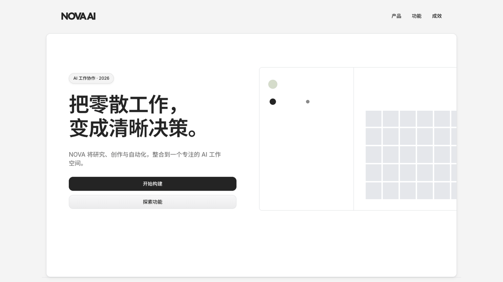</a></td><td><strong>Cal.com</strong><br>Monochrome scheduling geometry, light-gray outer frame, white inset hero card, left copy, and clipped calendar abstraction.<br><a href="references/cal-design-spec.md">English design spec</a> · <a href="https://mrmao007.github.io/awosome-frontend-styles/examples/cal.html">Live example</a></td></tr>
<tr><td width="38%"><a href="https://mrmao007.github.io/awosome-frontend-styles/examples/calendly.html">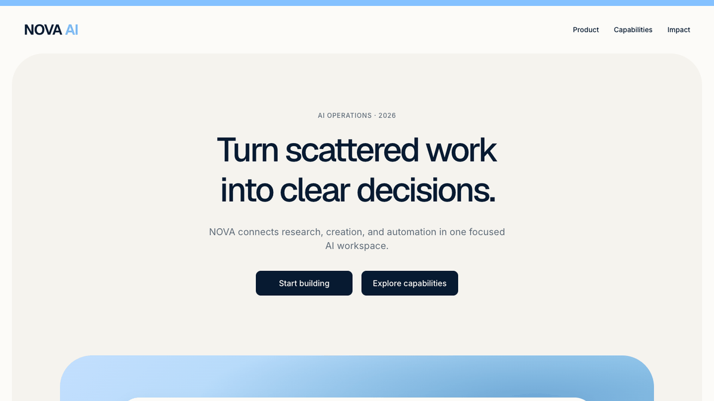</a></td><td><strong>Calendly</strong><br>Warm cream and deep navy, centered medium-weight type, pale-blue accents, and extremely rounded inset modular surfaces.<br><a href="references/calendly-design-spec.md">English design spec</a> · <a href="https://mrmao007.github.io/awosome-frontend-styles/examples/calendly.html">Live example</a></td></tr>
<tr><td width="38%"><a href="https://mrmao007.github.io/awosome-frontend-styles/examples/savvycal.html">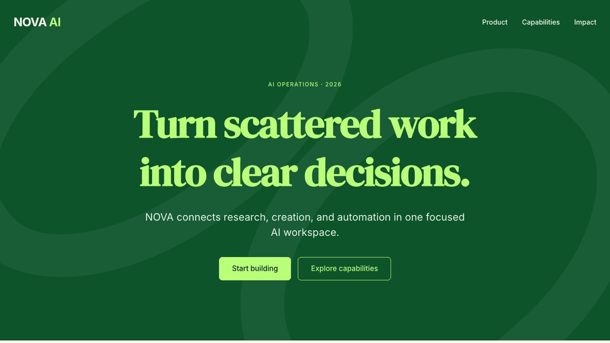</a></td><td><strong>SavvyCal</strong><br>Forest-green typographic poster, oversized lime serif headline, looping tonal bands, rectangular actions, and a warm cream lower canvas.<br><a href="references/savvycal-design-spec.md">English design spec</a> · <a href="https://mrmao007.github.io/awosome-frontend-styles/examples/savvycal.html">Live example</a></td></tr>
<tr><td width="38%"><a href="https://mrmao007.github.io/awosome-frontend-styles/examples/amie.html">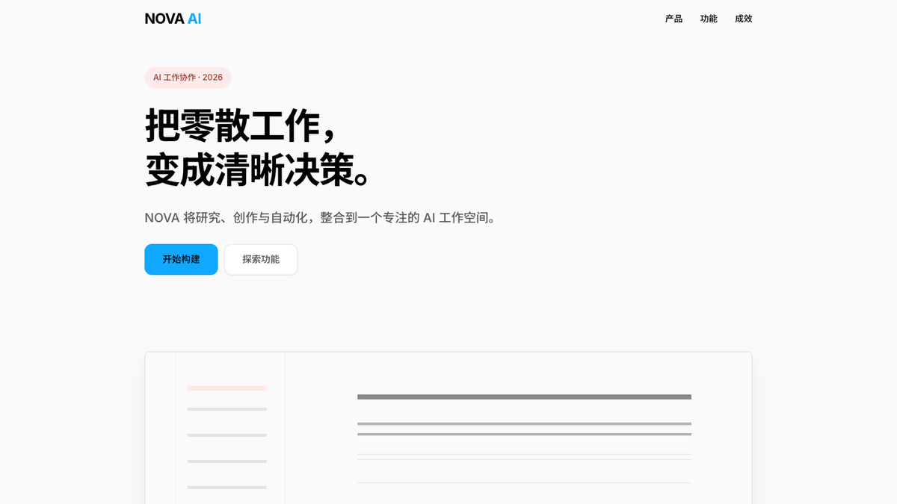</a></td><td><strong>Amie</strong><br>Quiet left-aligned utility, narrow gray-white canvas, black Inter headline, cyan actions, tiny coral badge, and a notes-window abstraction.<br><a href="references/amie-design-spec.md">English design spec</a> · <a href="https://mrmao007.github.io/awosome-frontend-styles/examples/amie.html">Live example</a></td></tr>
<tr><td width="38%"><a href="https://mrmao007.github.io/awosome-frontend-styles/examples/folk.html">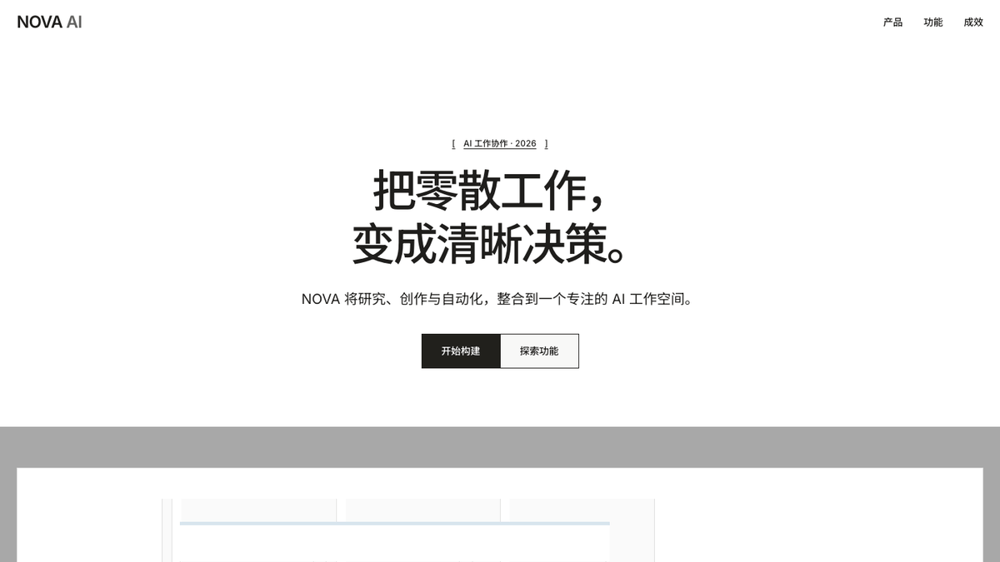</a></td><td><strong>folk</strong><br>Warm monochrome editorial hero, centered grotesque type, bracketed announcement, joined square actions, and a broad gray-backed board.<br><a href="references/folk-design-spec.md">English design spec</a> · <a href="https://mrmao007.github.io/awosome-frontend-styles/examples/folk.html">Live example</a></td></tr>
<tr><td width="38%"><a href="https://mrmao007.github.io/awosome-frontend-styles/examples/attio.html"></a></td><td><strong>Attio</strong><br>Precision white-and-slate typography, compact dark actions, outlined capsule, and periwinkle striped backdrop around a rounded app window.<br><a href="references/attio-design-spec.md">English design spec</a> · <a href="https://mrmao007.github.io/awosome-frontend-styles/examples/attio.html">Live example</a></td></tr>
<tr><td width="38%"><a href="https://mrmao007.github.io/awosome-frontend-styles/examples/front.html"></a></td><td><strong>Front</strong><br>Deep plum hero, moderate centered lilac type, citron pill actions, purple-framed inbox geometry, and navy-on-white lower sections.<br><a href="references/front-design-spec.md">English design spec</a> · <a href="https://mrmao007.github.io/awosome-frontend-styles/examples/front.html">Live example</a></td></tr>
</table>

</details>

<details>
<summary>Design &amp; Creation — 21 styles</summary>

<table>
<tr><td width="38%"><a href="https://mrmao007.github.io/awosome-frontend-styles/examples/miro.html">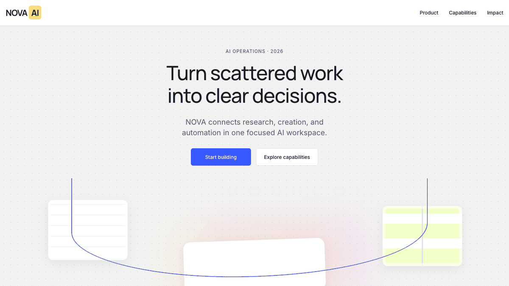</a></td><td><strong>Miro</strong><br>Light-gray dotted canvas, centered medium-weight type, blue rectangular actions, floating boards, curved connectors, and pastel sticky notes.<br><a href="references/miro-design-spec.md">English design spec</a> · <a href="https://mrmao007.github.io/awosome-frontend-styles/examples/miro.html">Live example</a></td></tr>
<tr><td width="38%"><a href="https://mrmao007.github.io/awosome-frontend-styles/examples/figma.html">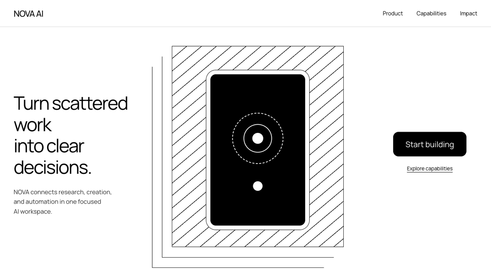</a></td><td><strong>Figma</strong><br>Sparse asymmetric gallery, regular black typography, detached oversized action, layered monochrome collage, and an inverted closing section.<br><a href="references/figma-design-spec.md">English design spec</a> · <a href="https://mrmao007.github.io/awosome-frontend-styles/examples/figma.html">Live example</a></td></tr>
<tr><td width="38%"><a href="https://mrmao007.github.io/awosome-frontend-styles/examples/framer.html">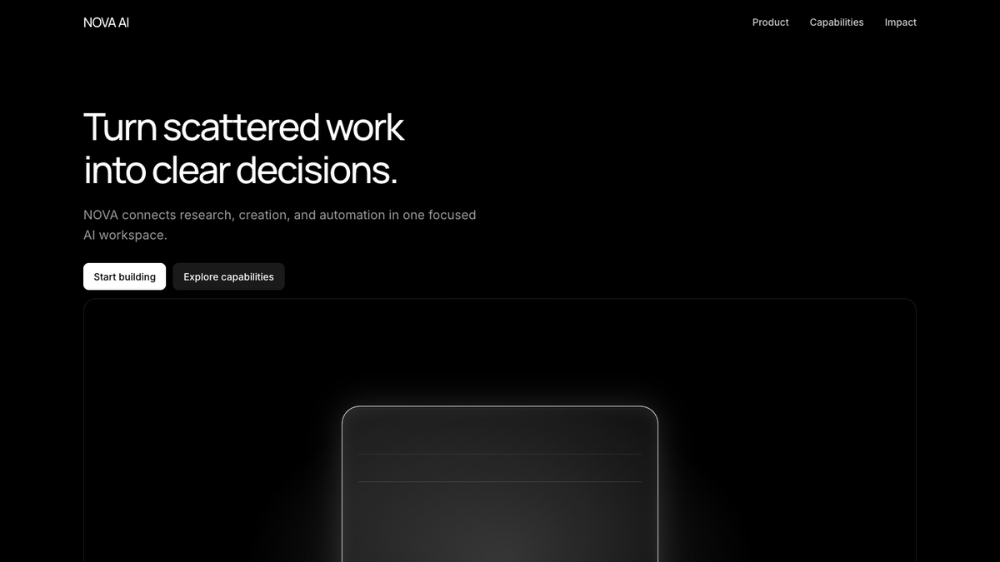</a></td><td><strong>Framer</strong><br>Black cinematic theater, left-aligned medium-weight typography, compact white actions, and a dominant wide illuminated media stage.<br><a href="references/framer-design-spec.md">English design spec</a> · <a href="https://mrmao007.github.io/awosome-frontend-styles/examples/framer.html">Live example</a></td></tr>
<tr><td width="38%"><a href="https://mrmao007.github.io/awosome-frontend-styles/examples/spline.html">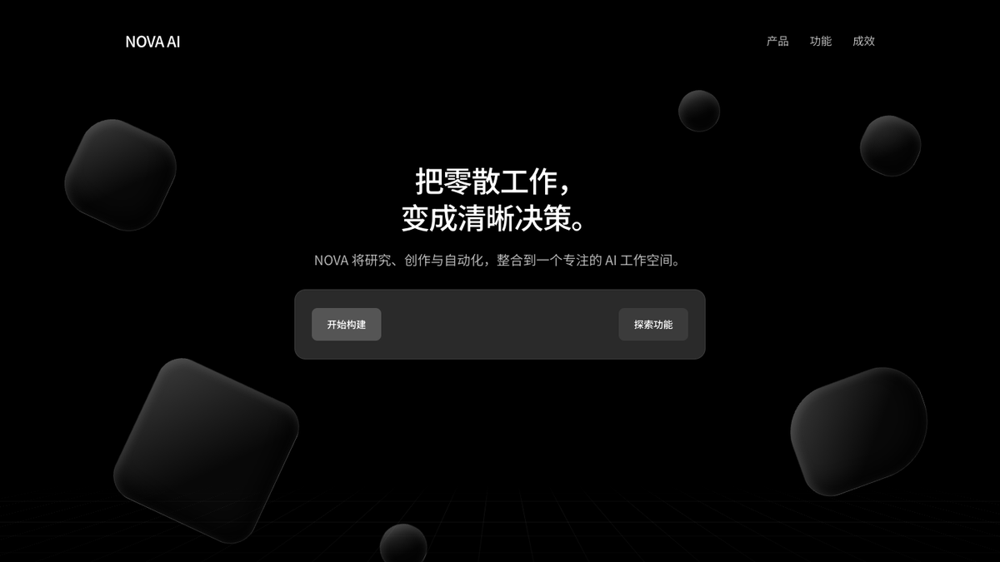</a></td><td><strong>Spline</strong><br>Modest centered white type on black, recessed action tray, floating softly lit solids, and a fading perspective floor.<br><a href="references/spline-design-spec.md">English design spec</a> · <a href="https://mrmao007.github.io/awosome-frontend-styles/examples/spline.html">Live example</a></td></tr>
<tr><td width="38%"><a href="https://mrmao007.github.io/awosome-frontend-styles/examples/rive.html">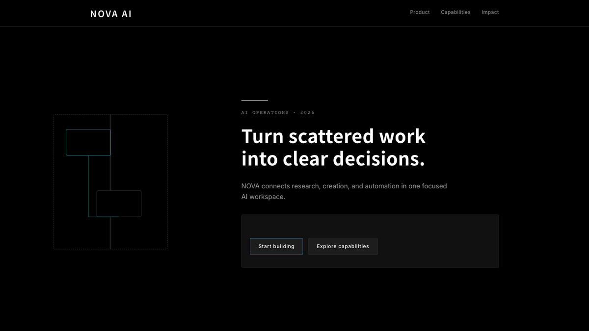</a></td><td><strong>Rive</strong><br>Black industrial console, right-shifted technical headline, recessed rectangular controls, sparse cyan state guides, and segmented instrument tracks.<br><a href="references/rive-design-spec.md">English design spec</a> · <a href="https://mrmao007.github.io/awosome-frontend-styles/examples/rive.html">Live example</a></td></tr>
<tr><td width="38%"><a href="https://mrmao007.github.io/awosome-frontend-styles/examples/readymag.html">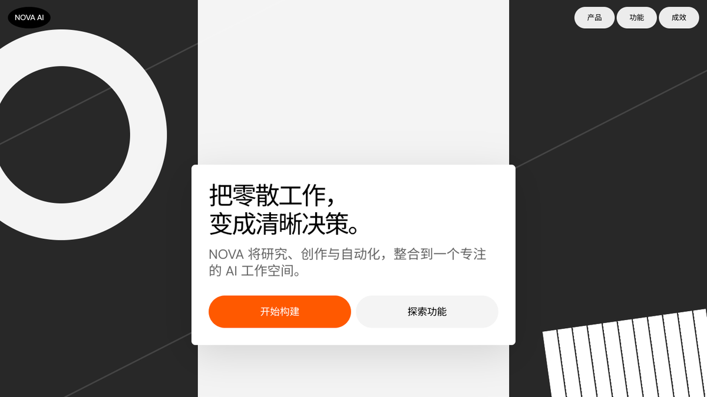</a></td><td><strong>Readymag</strong><br>Central white paper over full-bleed collage, separate navigation capsules, regular tight typography, and broad orange actions.<br><a href="references/readymag-design-spec.md">English design spec</a> · <a href="https://mrmao007.github.io/awosome-frontend-styles/examples/readymag.html">Live example</a></td></tr>
<tr><td width="38%"><a href="https://mrmao007.github.io/awosome-frontend-styles/examples/pitch.html">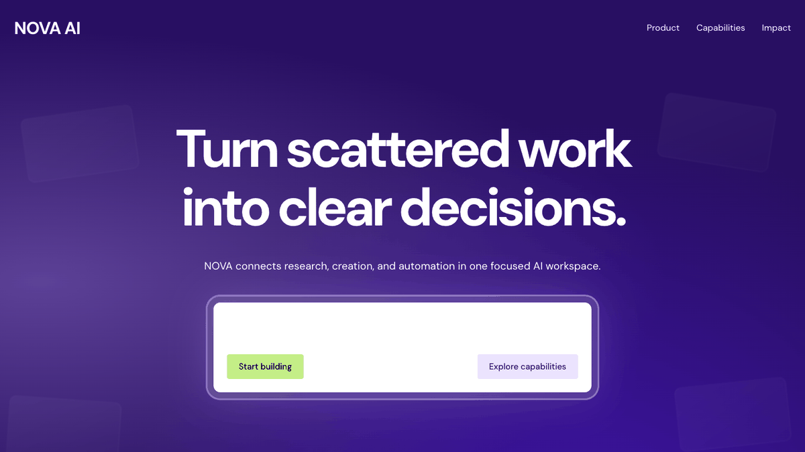</a></td><td><strong>Pitch</strong><br>Huge centered purple poster, floating slide miniatures, glowing white creation tray, lime accents, and widescreen paper tiles.<br><a href="references/pitch-design-spec.md">English design spec</a> · <a href="https://mrmao007.github.io/awosome-frontend-styles/examples/pitch.html">Live example</a></td></tr>
<tr><td width="38%"><a href="https://mrmao007.github.io/awosome-frontend-styles/examples/descript.html">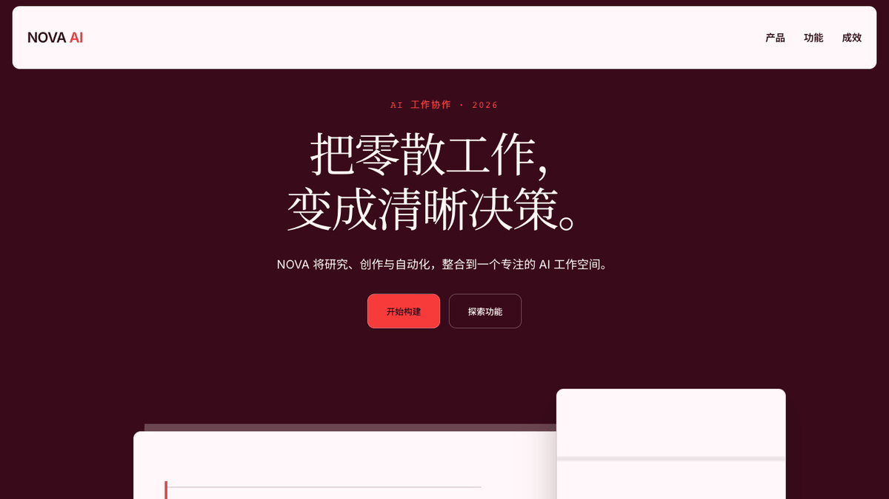</a></td><td><strong>Descript</strong><br>Ivory serif poster on wine, detached pale navigation, technical labels, red actions, and overlapping editor sheets.<br><a href="references/descript-design-spec.md">English design spec</a> · <a href="https://mrmao007.github.io/awosome-frontend-styles/examples/descript.html">Live example</a></td></tr>
<tr><td width="38%"><a href="https://mrmao007.github.io/awosome-frontend-styles/examples/jitter.html">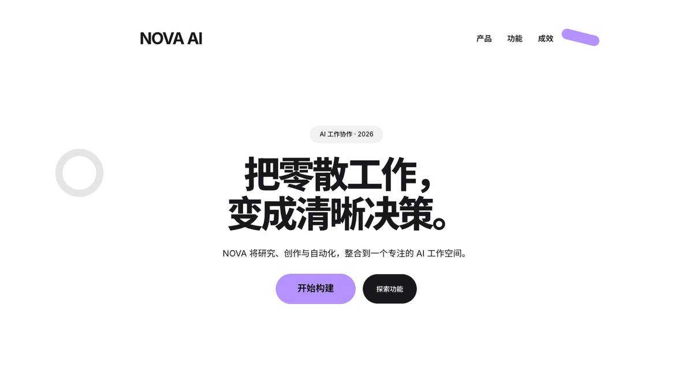</a></td><td><strong>Jitter</strong><br>Heavy centered typography on white, purple capsule, thin trust ribbon, and oversized soft-gray tiles with offset geometry.<br><a href="references/jitter-design-spec.md">English design spec</a> · <a href="https://mrmao007.github.io/awosome-frontend-styles/examples/jitter.html">Live example</a></td></tr>
<tr><td width="38%"><a href="https://mrmao007.github.io/awosome-frontend-styles/examples/tldraw.html">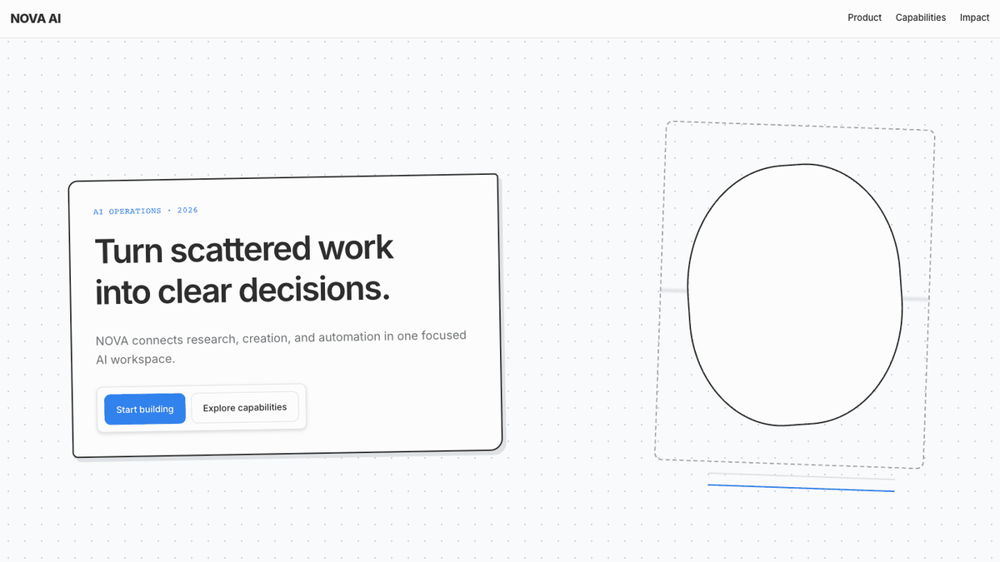</a></td><td><strong>tldraw</strong><br>Pale dotted whiteboard, rough annotation sheets, floating tool trays, blue selection accents, and lightly elevated paper notes.<br><a href="references/tldraw-design-spec.md">English design spec</a> · <a href="https://mrmao007.github.io/awosome-frontend-styles/examples/tldraw.html">Live example</a></td></tr>
<tr><td width="38%"><a href="https://mrmao007.github.io/awosome-frontend-styles/examples/penpot.html">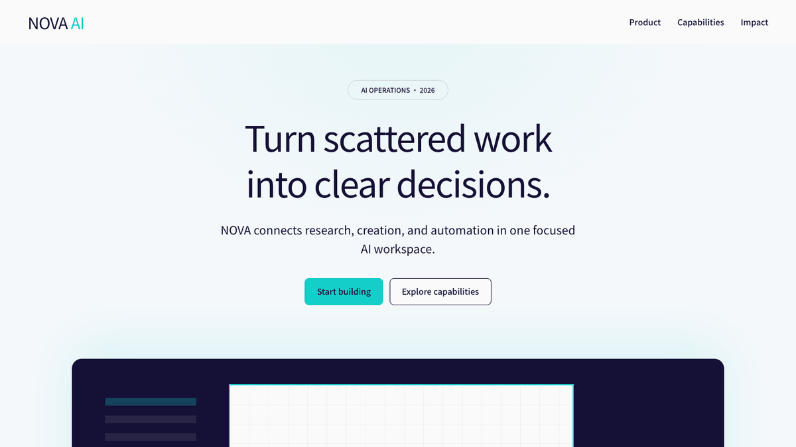</a></td><td><strong>Penpot</strong><br>Regular centered type on pale blue, navy ink, turquoise controls, and a broad dark editor shell with guides.<br><a href="references/penpot-design-spec.md">English design spec</a> · <a href="https://mrmao007.github.io/awosome-frontend-styles/examples/penpot.html">Live example</a></td></tr>
<tr><td width="38%"><a href="https://mrmao007.github.io/awosome-frontend-styles/examples/sketch.html">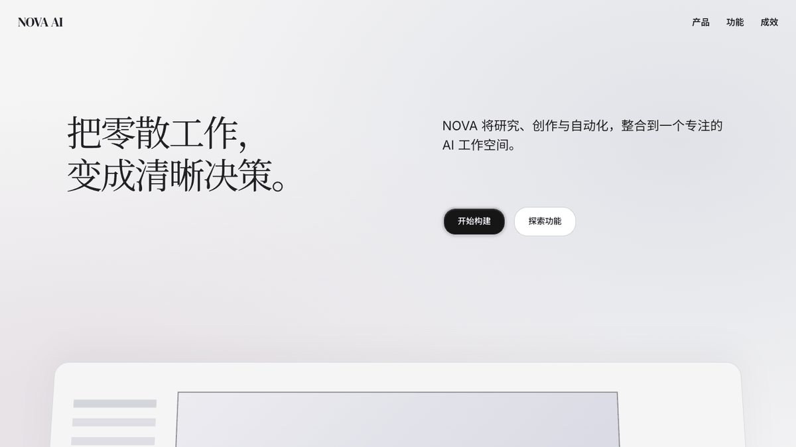</a></td><td><strong>Sketch</strong><br>Split serif editorial welcome, right-column copy and actions, neutral atmospheric wash, native-app preview, and softly inset white surfaces.<br><a href="references/sketch-design-spec.md">English design spec</a> · <a href="https://mrmao007.github.io/awosome-frontend-styles/examples/sketch.html">Live example</a></td></tr>
<tr><td width="38%"><a href="https://mrmao007.github.io/awosome-frontend-styles/examples/procreate.html">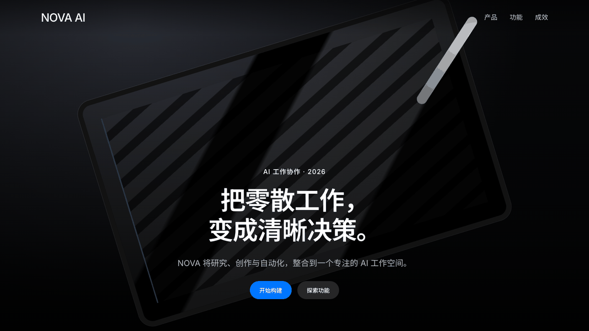</a></td><td><strong>Procreate</strong><br>Immersive dark stage with low-anchored white type, blue pills, charcoal strokes, and paired broad black product plates.<br><a href="references/procreate-design-spec.md">English design spec</a> · <a href="https://mrmao007.github.io/awosome-frontend-styles/examples/procreate.html">Live example</a></td></tr>
<tr><td width="38%"><a href="https://mrmao007.github.io/awosome-frontend-styles/examples/tally.html">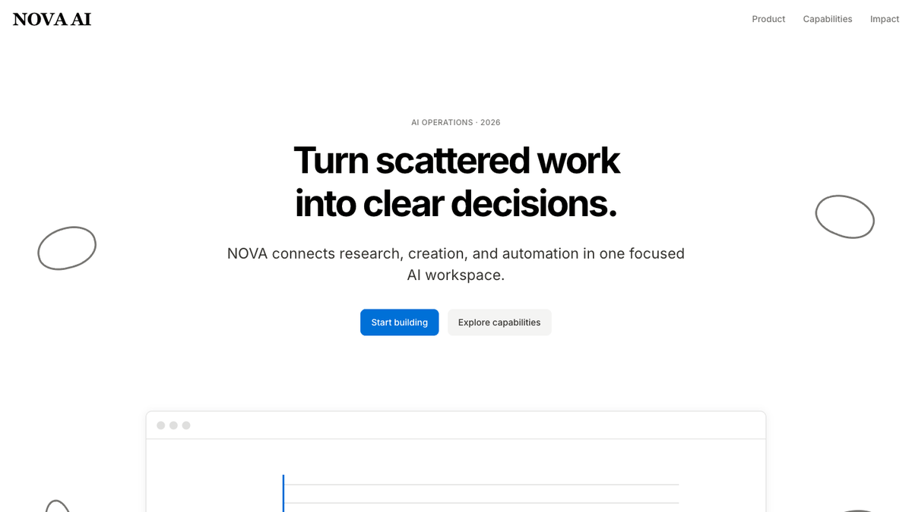</a></td><td><strong>Tally</strong><br>White document stage, centered black headline, blue actions, paper preview, gray marginal doodles, and numbered document rows.<br><a href="references/tally-design-spec.md">English design spec</a> · <a href="https://mrmao007.github.io/awosome-frontend-styles/examples/tally.html">Live example</a></td></tr>
<tr><td width="38%"><a href="https://mrmao007.github.io/awosome-frontend-styles/examples/kittl.html">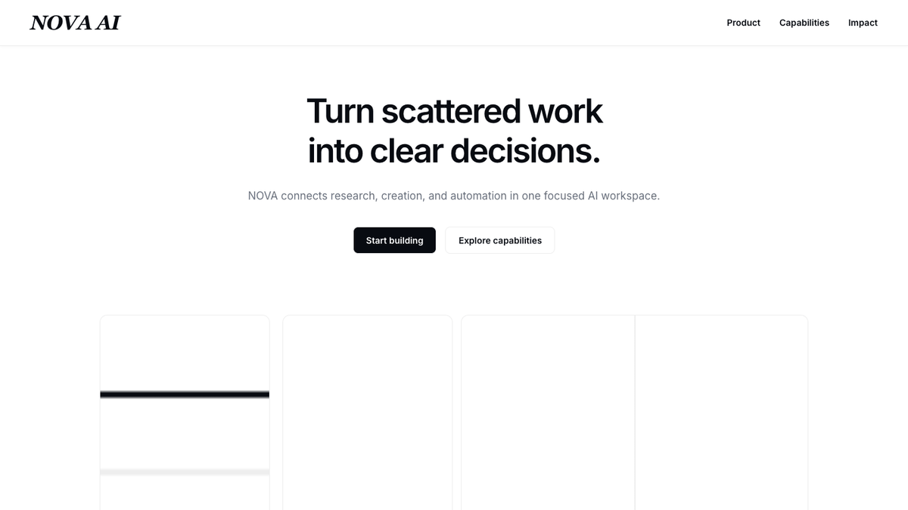</a></td><td><strong>Kittl</strong><br>Economical centered type on white, dark actions, four tall framed previews, and a clean captioned catalog grid.<br><a href="references/kittl-design-spec.md">English design spec</a> · <a href="https://mrmao007.github.io/awosome-frontend-styles/examples/kittl.html">Live example</a></td></tr>
<tr><td width="38%"><a href="https://mrmao007.github.io/awosome-frontend-styles/examples/milanote.html">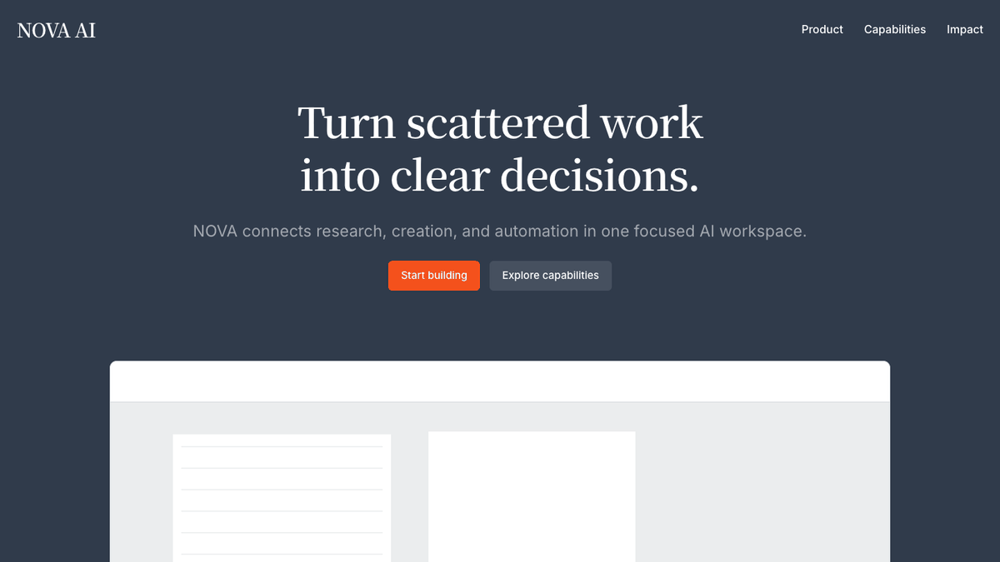</a></td><td><strong>Milanote</strong><br>White serif invitation on slate, orange action, pale pinboard crossing a diagonal boundary, and staggered paper notes.<br><a href="references/milanote-design-spec.md">English design spec</a> · <a href="https://mrmao007.github.io/awosome-frontend-styles/examples/milanote.html">Live example</a></td></tr>
<tr><td width="38%"><a href="https://mrmao007.github.io/awosome-frontend-styles/examples/visme.html">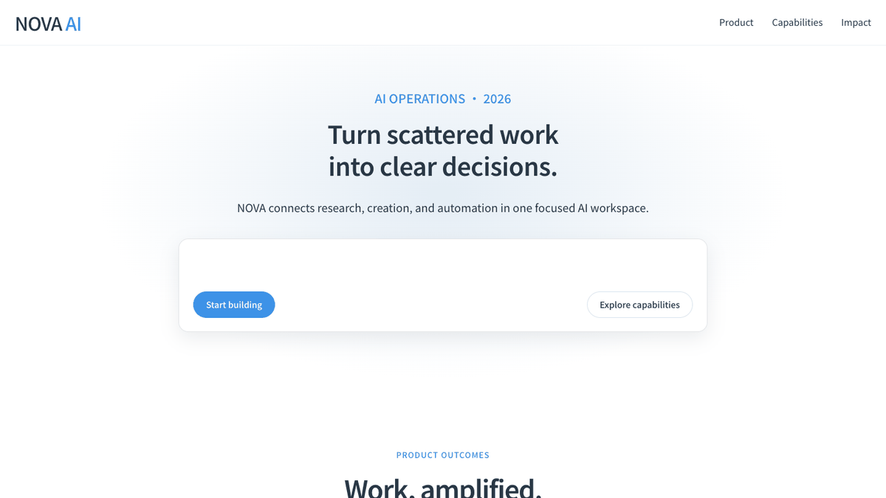</a></td><td><strong>Visme</strong><br>Moderate centered greeting, soft blue-gray haze, wide raised creation tray, compact blue controls, and restrained downstream template-choice tiles.<br><a href="references/visme-design-spec.md">English design spec</a> · <a href="https://mrmao007.github.io/awosome-frontend-styles/examples/visme.html">Live example</a></td></tr>
<tr><td width="38%"><a href="https://mrmao007.github.io/awosome-frontend-styles/examples/photopea.html">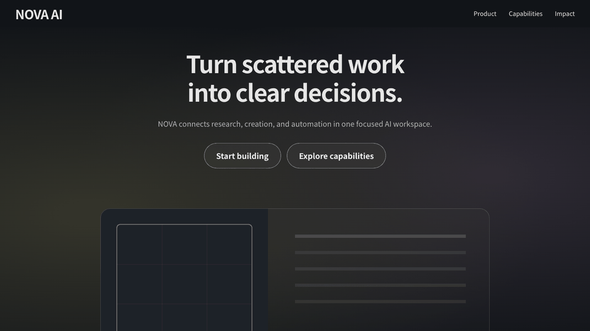</a></td><td><strong>Photopea</strong><br>Dark utility landing, bold centered headline, outlined white capsules, muted atmosphere, and a balanced crop-grid explanation split.<br><a href="references/photopea-design-spec.md">English design spec</a> · <a href="https://mrmao007.github.io/awosome-frontend-styles/examples/photopea.html">Live example</a></td></tr>
<tr><td width="38%"><a href="https://mrmao007.github.io/awosome-frontend-styles/examples/linearity.html">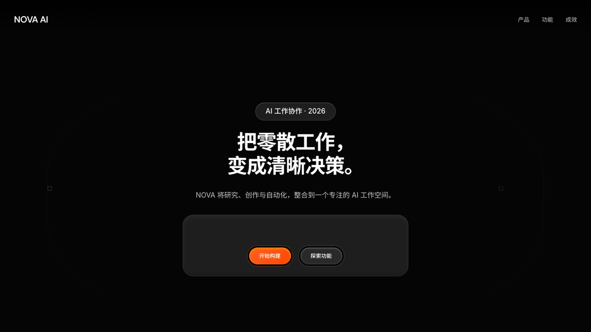</a></td><td><strong>Linearity</strong><br>Near-black console, modest centered promise, glossy capsules, beveled charcoal tray, orange jewel controls, and fine vector guides.<br><a href="references/linearity-design-spec.md">English design spec</a> · <a href="https://mrmao007.github.io/awosome-frontend-styles/examples/linearity.html">Live example</a></td></tr>
<tr><td width="38%"><a href="https://mrmao007.github.io/awosome-frontend-styles/examples/coreldraw.html">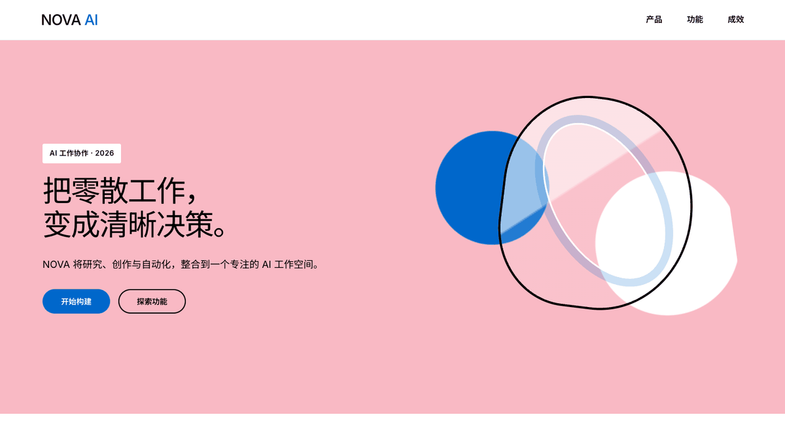</a></td><td><strong>CorelDRAW</strong><br>Pink illustrated hero, regular black left-aligned display, release badge, blue and outlined pills, then a white tiered catalog.<br><a href="references/coreldraw-design-spec.md">English design spec</a> · <a href="https://mrmao007.github.io/awosome-frontend-styles/examples/coreldraw.html">Live example</a></td></tr>
<tr><td width="38%"><a href="https://mrmao007.github.io/awosome-frontend-styles/examples/graphite.html">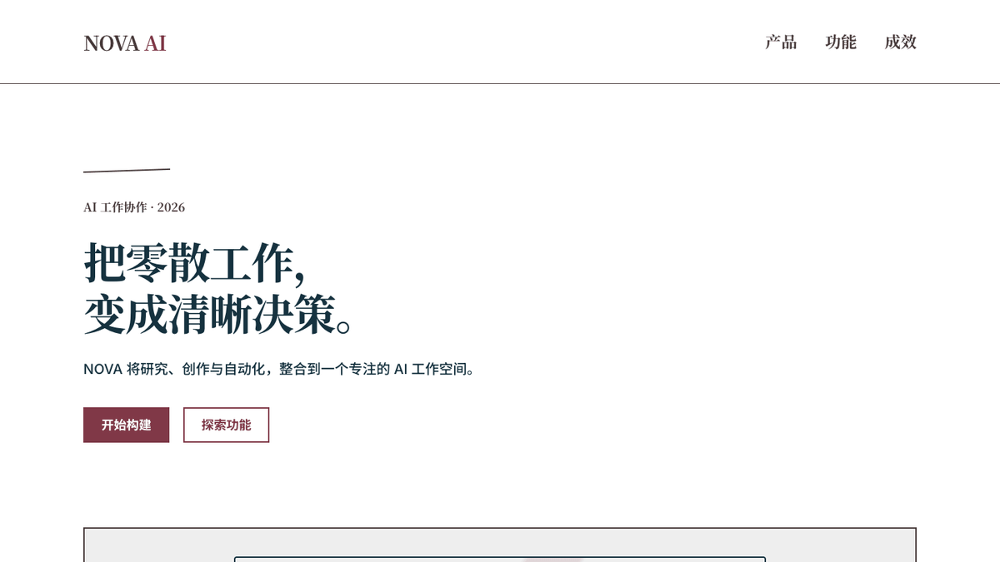</a></td><td><strong>Graphite</strong><br>Handcrafted white-paper workshop, heavyweight serif headings and navigation, blue-green ink, square burgundy controls, irregular rules, and node-path linework.<br><a href="references/graphite-design-spec.md">English design spec</a> · <a href="https://mrmao007.github.io/awosome-frontend-styles/examples/graphite.html">Live example</a></td></tr>
</table>

</details>

<details>
<summary>AI Products — 19 styles</summary>

<table>
<tr><td width="38%"><a href="https://mrmao007.github.io/awosome-frontend-styles/examples/sambanova.html">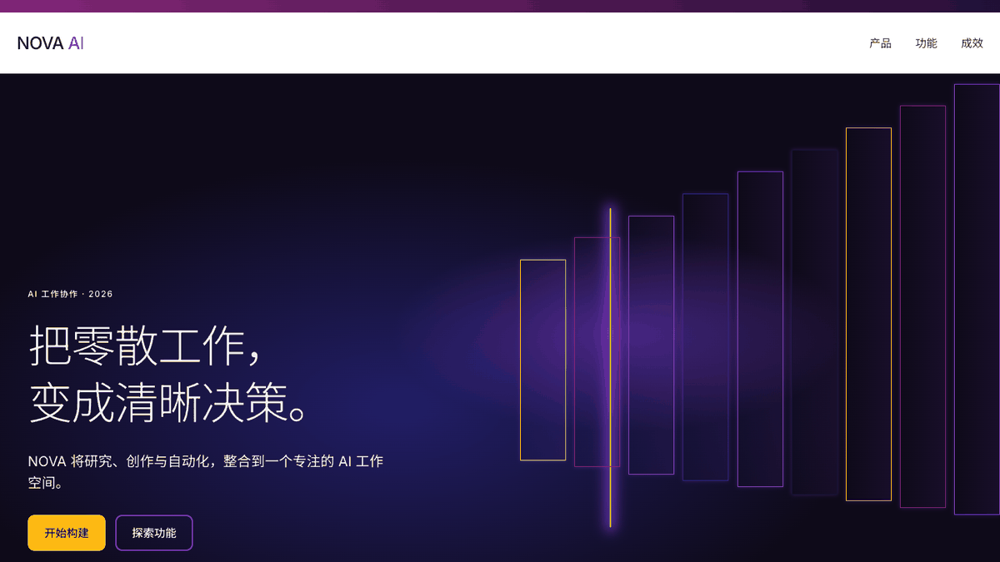</a></td><td><strong>SambaNova</strong><br>White navigation over a dark-violet infrastructure stage, lightweight lower-left type, gold actions, and receding translucent spectral planes.<br><a href="references/sambanova-design-spec.md">English design spec</a> · <a href="https://mrmao007.github.io/awosome-frontend-styles/examples/sambanova.html">Live example</a></td></tr>
<tr><td width="38%"><a href="https://mrmao007.github.io/awosome-frontend-styles/examples/anthropic.html">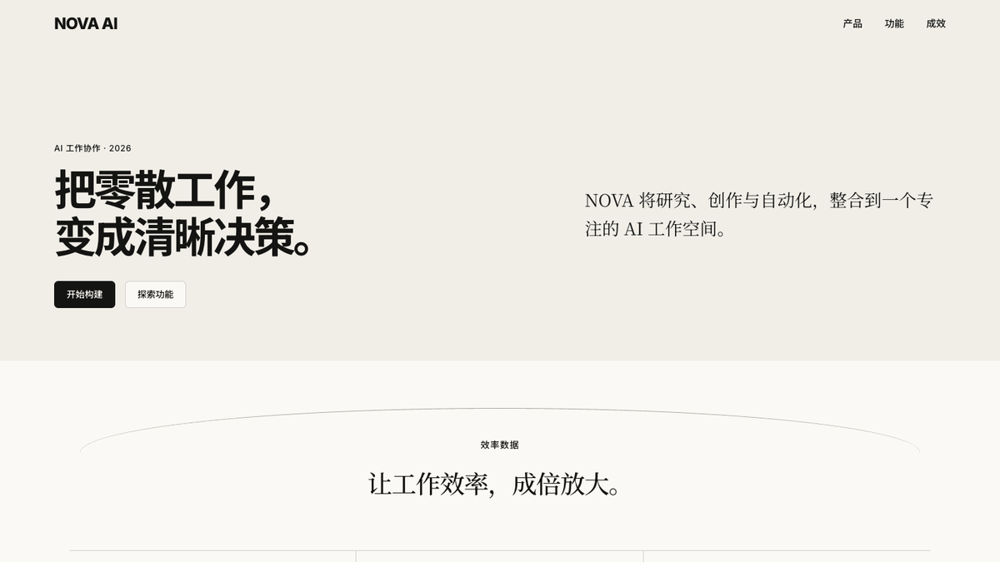</a></td><td><strong>Anthropic</strong><br>Warm paper fields, assertive sans-serif statements, serif reading columns, fine editorial rules and restrained black actions.<br><a href="references/anthropic-design-spec.md">English design spec</a> · <a href="https://mrmao007.github.io/awosome-frontend-styles/examples/anthropic.html">Live example</a></td></tr>
<tr><td width="38%"><a href="https://mrmao007.github.io/awosome-frontend-styles/examples/cursor.html">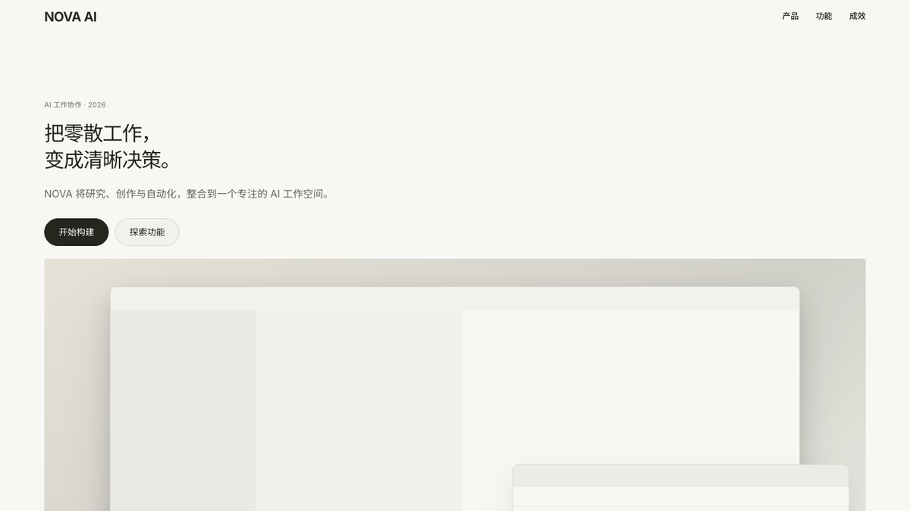</a></td><td><strong>Cursor</strong><br>Compact regular-weight introduction, warm near-white surfaces, dark pill actions and a dominant layered desktop-preview stage.<br><a href="references/cursor-design-spec.md">English design spec</a> · <a href="https://mrmao007.github.io/awosome-frontend-styles/examples/cursor.html">Live example</a></td></tr>
<tr><td width="38%"><a href="https://mrmao007.github.io/awosome-frontend-styles/examples/v0.html">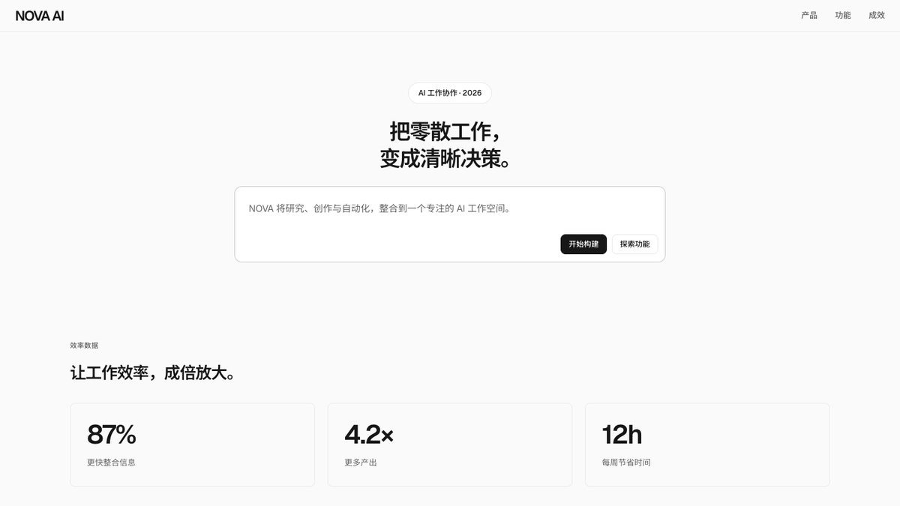</a></td><td><strong>v0</strong><br>Achromatic utility interface with a compact centered composer, thin gray borders, suggestion pills and a thumbnail gallery.<br><a href="references/v0-design-spec.md">English design spec</a> · <a href="https://mrmao007.github.io/awosome-frontend-styles/examples/v0.html">Live example</a></td></tr>
<tr><td width="38%"><a href="https://mrmao007.github.io/awosome-frontend-styles/examples/elevenlabs.html">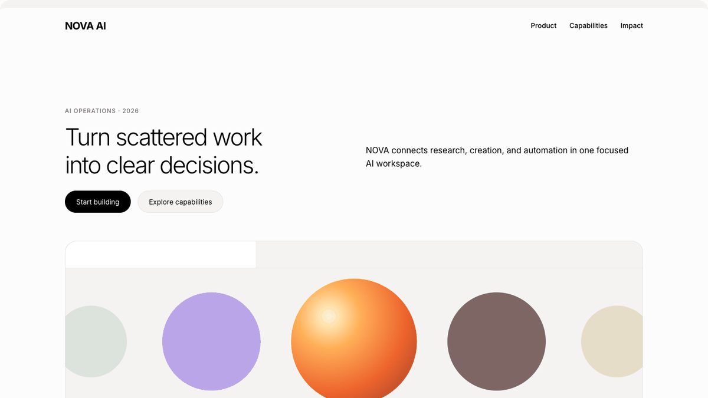</a></td><td><strong>ElevenLabs</strong><br>Light split typography, warm off-white surfaces, black pills and a wide rounded showroom of tactile gradient spheres.<br><a href="references/elevenlabs-design-spec.md">English design spec</a> · <a href="https://mrmao007.github.io/awosome-frontend-styles/examples/elevenlabs.html">Live example</a></td></tr>
<tr><td width="38%"><a href="https://mrmao007.github.io/awosome-frontend-styles/examples/runway.html">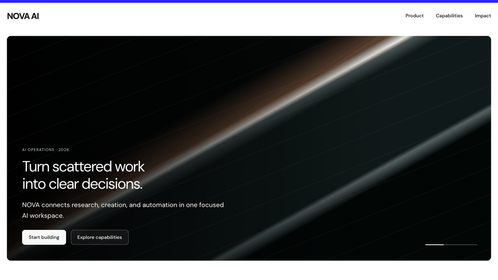</a></td><td><strong>Runway</strong><br>White navigation frames a dark widescreen scene, moderate bottom-left typography, practical buttons and alternating pale poster tiles.<br><a href="references/runway-design-spec.md">English design spec</a> · <a href="https://mrmao007.github.io/awosome-frontend-styles/examples/runway.html">Live example</a></td></tr>
<tr><td width="38%"><a href="https://mrmao007.github.io/awosome-frontend-styles/examples/synthesia.html">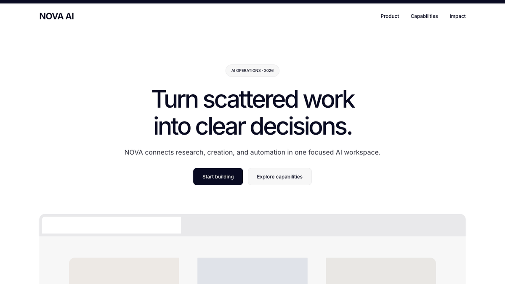</a></td><td><strong>Synthesia</strong><br>Oversized tightly tracked navy headline, white canvas, small proof pill, paired actions and a broad pale tabbed showroom.<br><a href="references/synthesia-design-spec.md">English design spec</a> · <a href="https://mrmao007.github.io/awosome-frontend-styles/examples/synthesia.html">Live example</a></td></tr>
<tr><td width="38%"><a href="https://mrmao007.github.io/awosome-frontend-styles/examples/jasper.html">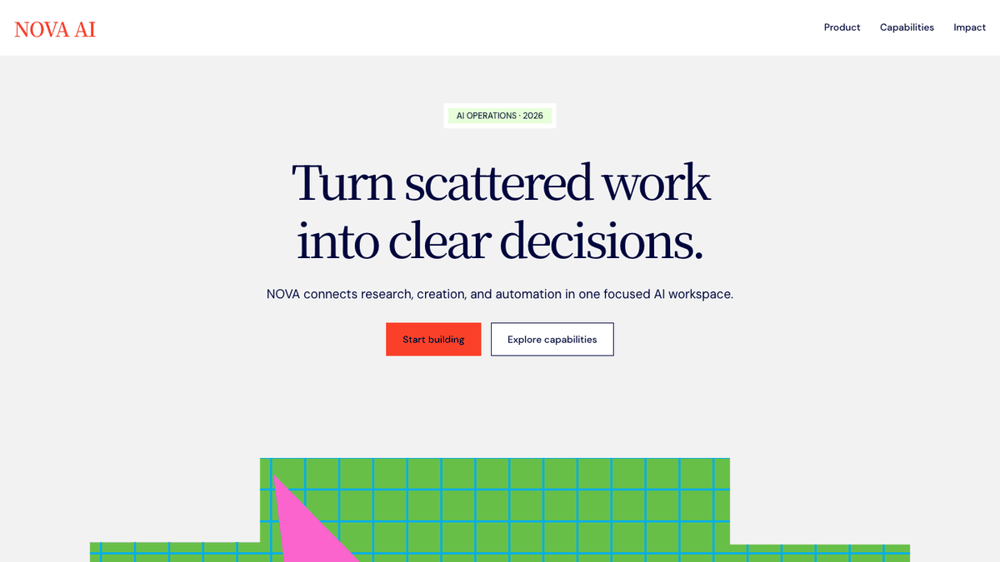</a></td><td><strong>Jasper</strong><br>Large editorial serif type, pale gray canvas, navy outlines, square orange-red actions and vivid stepped geometric collage.<br><a href="references/jasper-design-spec.md">English design spec</a> · <a href="https://mrmao007.github.io/awosome-frontend-styles/examples/jasper.html">Live example</a></td></tr>
<tr><td width="38%"><a href="https://mrmao007.github.io/awosome-frontend-styles/examples/grammarly.html">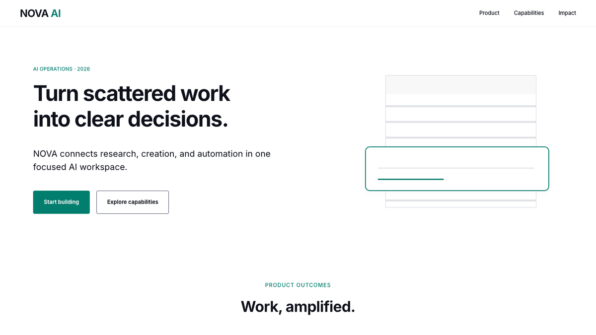</a></td><td><strong>Grammarly</strong><br>Strong left-aligned black type, teal rectangular actions, white document geometry and spacious unboxed trust and feature rows.<br><a href="references/grammarly-design-spec.md">English design spec</a> · <a href="https://mrmao007.github.io/awosome-frontend-styles/examples/grammarly.html">Live example</a></td></tr>
<tr><td width="38%"><a href="https://mrmao007.github.io/awosome-frontend-styles/examples/together.html">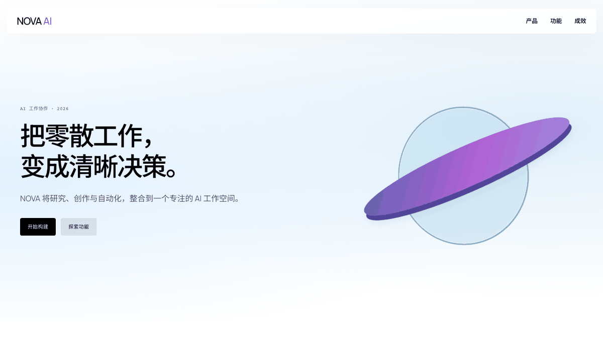</a></td><td><strong>Together AI</strong><br>Pale atmospheric split, substantial black type, detached white navigation, monospace actions and translucent intersecting mechanical discs.<br><a href="references/together-design-spec.md">English design spec</a> · <a href="https://mrmao007.github.io/awosome-frontend-styles/examples/together.html">Live example</a></td></tr>
<tr><td width="38%"><a href="https://mrmao007.github.io/awosome-frontend-styles/examples/cohere.html">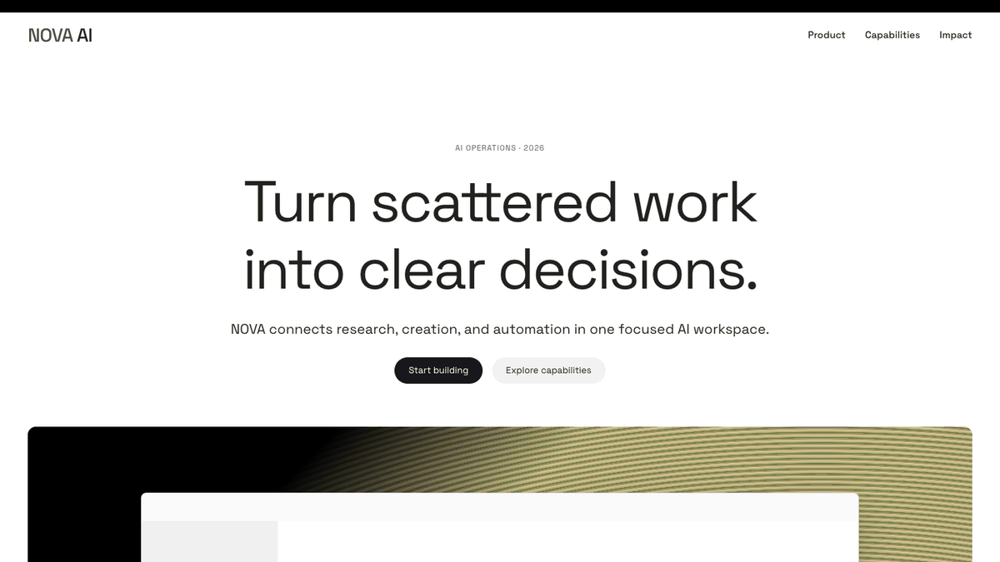</a></td><td><strong>Cohere</strong><br>Huge regular-weight centered type above an organic contour stage, discreet dark pills and disciplined pale software-library panels.<br><a href="references/cohere-design-spec.md">English design spec</a> · <a href="https://mrmao007.github.io/awosome-frontend-styles/examples/cohere.html">Live example</a></td></tr>
<tr><td width="38%"><a href="https://mrmao007.github.io/awosome-frontend-styles/examples/devin.html">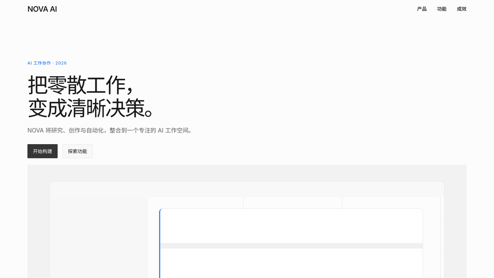</a></td><td><strong>Devin Desktop</strong><br>White operational canvas, large plain left headline, compact dark actions and a wide pale work-board with blue markers.<br><a href="references/devin-design-spec.md">English design spec</a> · <a href="https://mrmao007.github.io/awosome-frontend-styles/examples/devin.html">Live example</a></td></tr>
<tr><td width="38%"><a href="https://mrmao007.github.io/awosome-frontend-styles/examples/deepl.html">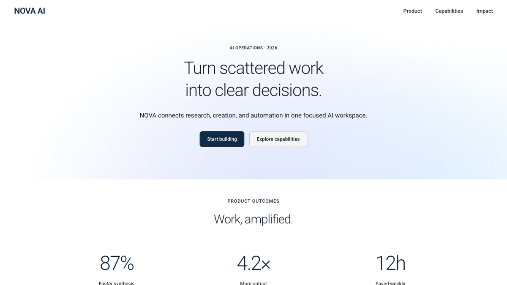</a></td><td><strong>DeepL</strong><br>Thin centered type, navy actions and soft blue-lilac illumination around a translucent workspace with white inner panels.<br><a href="references/deepl-design-spec.md">English design spec</a> · <a href="https://mrmao007.github.io/awosome-frontend-styles/examples/deepl.html">Live example</a></td></tr>
<tr><td width="38%"><a href="https://mrmao007.github.io/awosome-frontend-styles/examples/fireflies.html"></a></td><td><strong>Fireflies</strong><br>Midnight-violet theater, centered loosely tracked white type, bright purple rectangles, faint stars and a bottom-entry white software panel.<br><a href="references/fireflies-design-spec.md">English design spec</a> · <a href="https://mrmao007.github.io/awosome-frontend-styles/examples/fireflies.html">Live example</a></td></tr>
<tr><td width="38%"><a href="https://mrmao007.github.io/awosome-frontend-styles/examples/otter.html">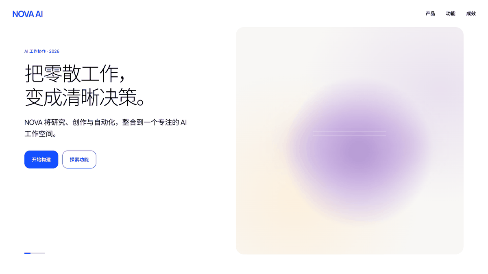</a></td><td><strong>Otter</strong><br>Airy asymmetric spread, light black typography, saturated blue actions and a tall softly rounded lilac-cream media pane.<br><a href="references/otter-design-spec.md">English design spec</a> · <a href="https://mrmao007.github.io/awosome-frontend-styles/examples/otter.html">Live example</a></td></tr>
<tr><td width="38%"><a href="https://mrmao007.github.io/awosome-frontend-styles/examples/writer.html">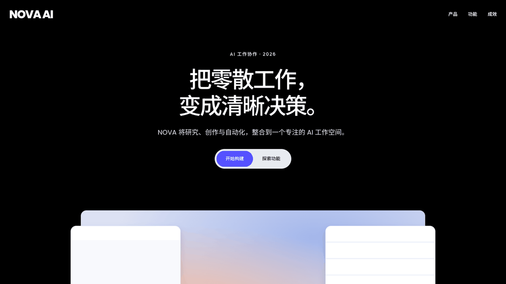</a></td><td><strong>Writer</strong><br>Black enterprise stage, centered white geometric type, vivid violet conversion pill and bright floating software panels.<br><a href="references/writer-design-spec.md">English design spec</a> · <a href="https://mrmao007.github.io/awosome-frontend-styles/examples/writer.html">Live example</a></td></tr>
<tr><td width="38%"><a href="https://mrmao007.github.io/awosome-frontend-styles/examples/assemblyai.html">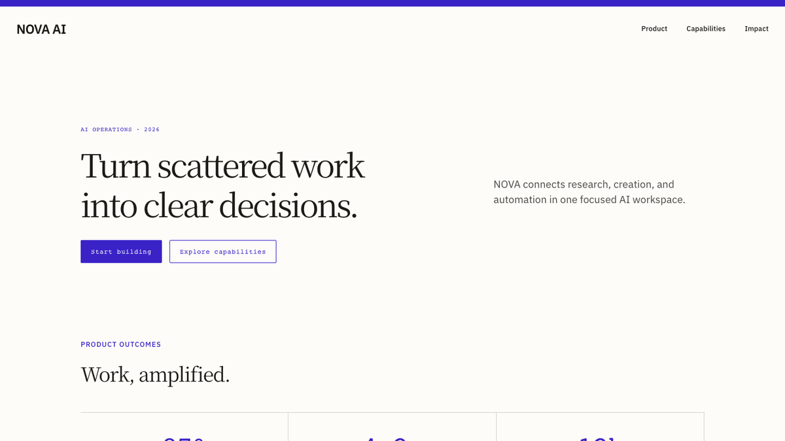</a></td><td><strong>AssemblyAI</strong><br>Cream technical editorial layout, refined serif statements, purple monospace controls and thinly ruled instrument-panel surfaces.<br><a href="references/assemblyai-design-spec.md">English design spec</a> · <a href="https://mrmao007.github.io/awosome-frontend-styles/examples/assemblyai.html">Live example</a></td></tr>
<tr><td width="38%"><a href="https://mrmao007.github.io/awosome-frontend-styles/examples/groq.html">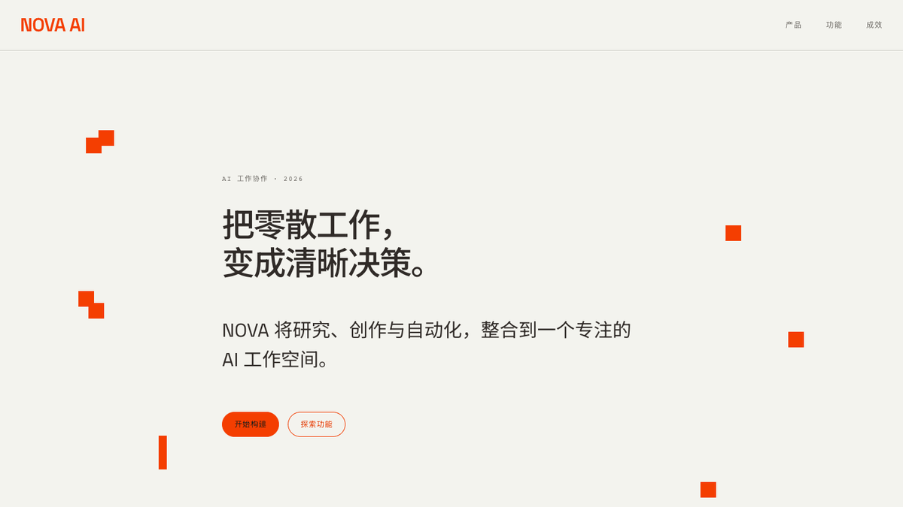</a></td><td><strong>Groq</strong><br>Warm-gray manifesto column, bold paragraph-like statements, monospace labels, orange pixel fragments and strong ruled indexed lists.<br><a href="references/groq-design-spec.md">English design spec</a> · <a href="https://mrmao007.github.io/awosome-frontend-styles/examples/groq.html">Live example</a></td></tr>
<tr><td width="38%"><a href="https://mrmao007.github.io/awosome-frontend-styles/examples/cerebras.html">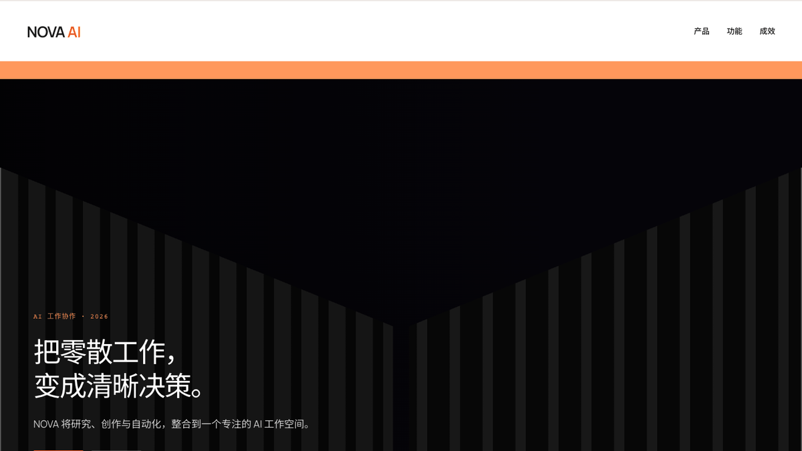</a></td><td><strong>Cerebras</strong><br>Tall white navigation, orange announcement edge, vast dark corridor imagery, low regular-weight copy and hard-edged hardware panels.<br><a href="references/cerebras-design-spec.md">English design spec</a> · <a href="https://mrmao007.github.io/awosome-frontend-styles/examples/cerebras.html">Live example</a></td></tr>
</table>

</details>

<details>
<summary>Developer Tools — 21 styles</summary>

<table>
<tr><td width="38%"><a href="https://mrmao007.github.io/awosome-frontend-styles/examples/replicate.html">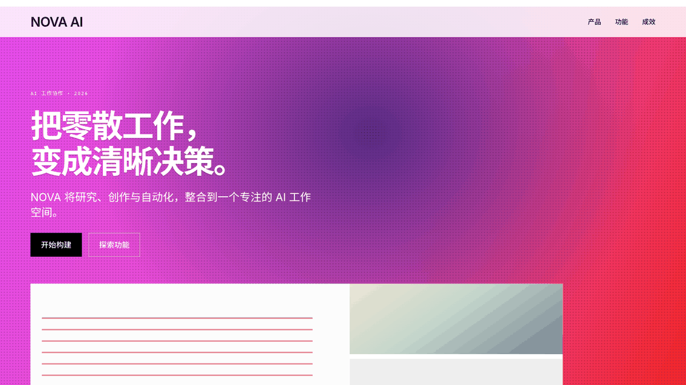</a></td><td><strong>Replicate</strong><br>Heavy white type on vivid halftone color, square black actions, flat demonstration panes and a practical bordered catalog.<br><a href="references/replicate-design-spec.md">English design spec</a> · <a href="https://mrmao007.github.io/awosome-frontend-styles/examples/replicate.html">Live example</a></td></tr>
<tr><td width="38%"><a href="https://mrmao007.github.io/awosome-frontend-styles/examples/vercel.html">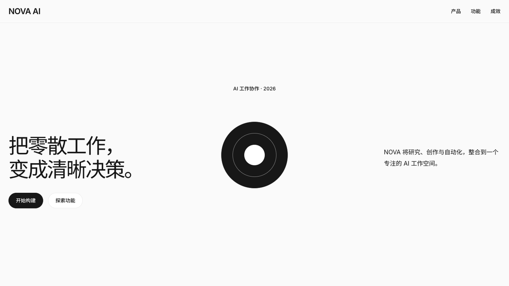</a></td><td><strong>Vercel</strong><br>Quiet near-white canvas, light oversized type, lateral hero, concentric black primitive, and continuous hairline grids.<br><a href="references/vercel-design-spec.md">English design spec</a> · <a href="https://mrmao007.github.io/awosome-frontend-styles/examples/vercel.html">Live example</a></td></tr>
<tr><td width="38%"><a href="https://mrmao007.github.io/awosome-frontend-styles/examples/supabase.html">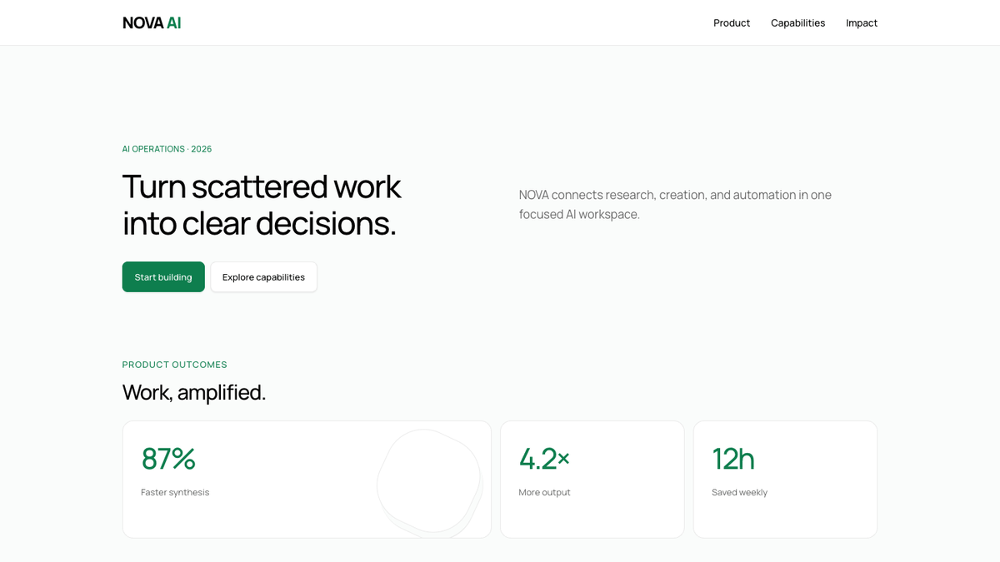</a></td><td><strong>Supabase</strong><br>Almost-white canvas, modest Manrope display, practical green actions, and tightly integrated asymmetric service bento.<br><a href="references/supabase-design-spec.md">English design spec</a> · <a href="https://mrmao007.github.io/awosome-frontend-styles/examples/supabase.html">Live example</a></td></tr>
<tr><td width="38%"><a href="https://mrmao007.github.io/awosome-frontend-styles/examples/netlify.html">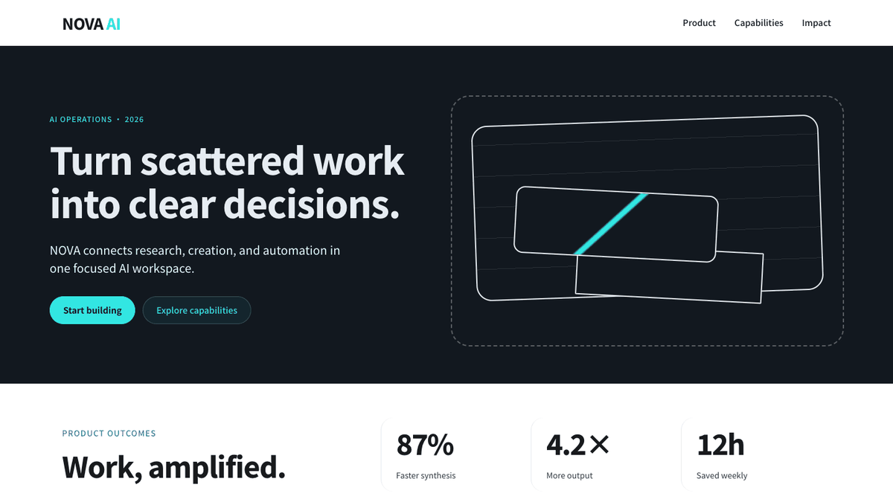</a></td><td><strong>Netlify</strong><br>White navigation frames a dark cyan-action hero, heavy Figtree type, and loosely rotated dashed interface geometry.<br><a href="references/netlify-design-spec.md">English design spec</a> · <a href="https://mrmao007.github.io/awosome-frontend-styles/examples/netlify.html">Live example</a></td></tr>
<tr><td width="38%"><a href="https://mrmao007.github.io/awosome-frontend-styles/examples/render.html">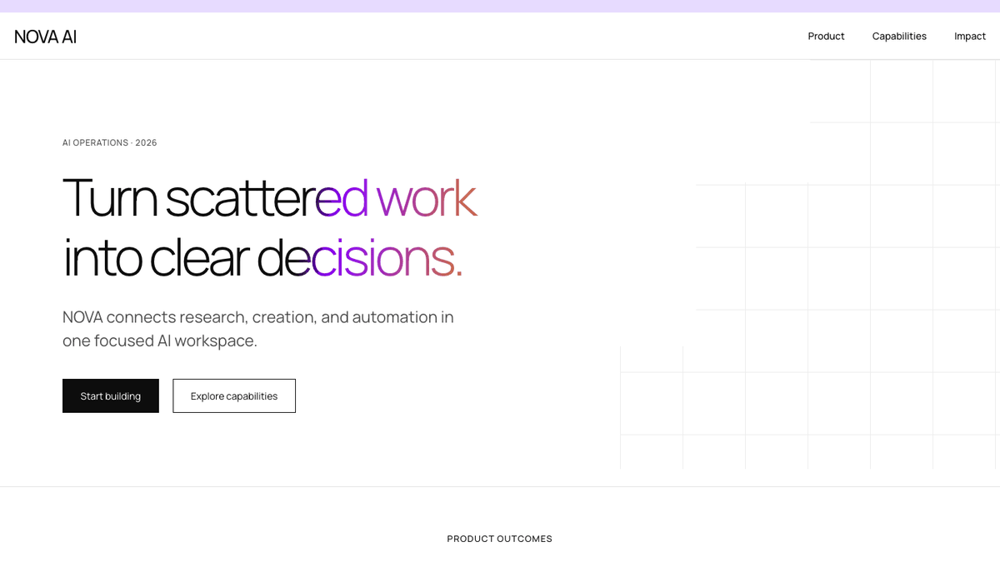</a></td><td><strong>Render</strong><br>Light oversized type, square black controls, ruled white architecture, stepped grids, and a restrained violet-to-copper headline gradient.<br><a href="references/render-design-spec.md">English design spec</a> · <a href="https://mrmao007.github.io/awosome-frontend-styles/examples/render.html">Live example</a></td></tr>
<tr><td width="38%"><a href="https://mrmao007.github.io/awosome-frontend-styles/examples/fly.html">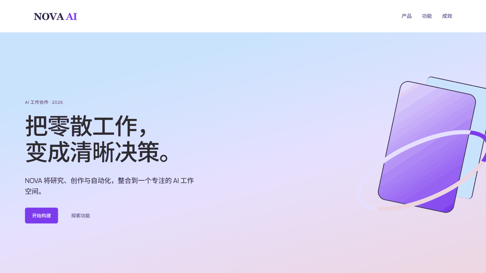</a></td><td><strong>Fly.io</strong><br>Welcoming serif-led landscape, sky-to-rose pastels, violet controls, cream paired cards, and softly offset dimensional geometry.<br><a href="references/fly-design-spec.md">English design spec</a> · <a href="https://mrmao007.github.io/awosome-frontend-styles/examples/fly.html">Live example</a></td></tr>
<tr><td width="38%"><a href="https://mrmao007.github.io/awosome-frontend-styles/examples/cloudflare.html">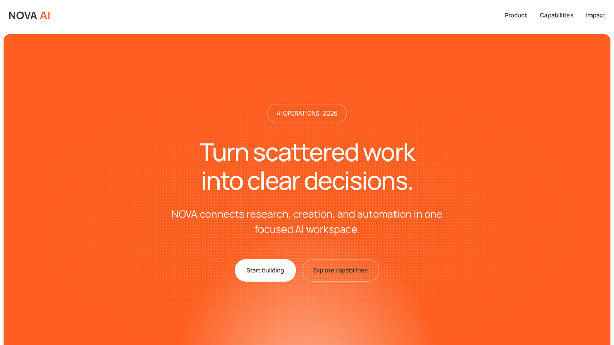</a></td><td><strong>Cloudflare</strong><br>Centered medium-weight type inside a rounded orange campaign slab, white perimeter, fine dots, and bottom illumination.<br><a href="references/cloudflare-design-spec.md">English design spec</a> · <a href="https://mrmao007.github.io/awosome-frontend-styles/examples/cloudflare.html">Live example</a></td></tr>
<tr><td width="38%"><a href="https://mrmao007.github.io/awosome-frontend-styles/examples/sentry.html">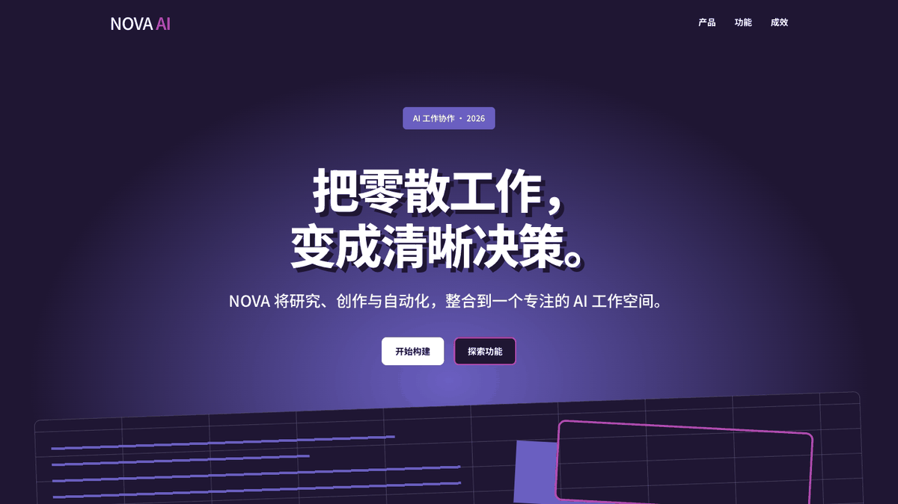</a></td><td><strong>Sentry</strong><br>Loud aubergine stage, huge white display, hot-pink signals, tilted diagnostic frames, and offset violet card edges.<br><a href="references/sentry-design-spec.md">English design spec</a> · <a href="https://mrmao007.github.io/awosome-frontend-styles/examples/sentry.html">Live example</a></td></tr>
<tr><td width="38%"><a href="https://mrmao007.github.io/awosome-frontend-styles/examples/postman.html">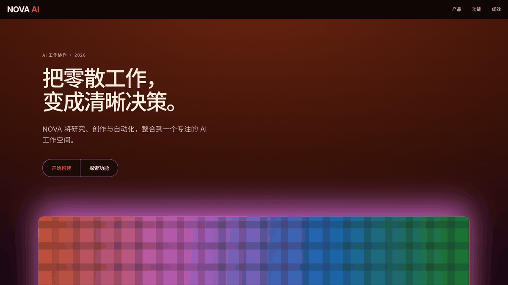</a></td><td><strong>Postman</strong><br>Warm ember-dark canvas, cream typography, segmented install-like actions, monospaced labels, and a spectrum-lit lower horizon.<br><a href="references/postman-design-spec.md">English design spec</a> · <a href="https://mrmao007.github.io/awosome-frontend-styles/examples/postman.html">Live example</a></td></tr>
<tr><td width="38%"><a href="https://mrmao007.github.io/awosome-frontend-styles/examples/insomnia.html">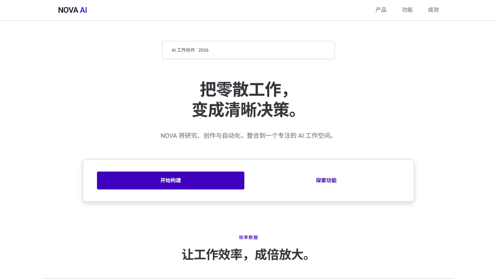</a></td><td><strong>Insomnia</strong><br>Practical centered Roboto hierarchy, white canvas, bordered announcement, raised action panel, compact purple controls, and charcoal capability band.<br><a href="references/insomnia-design-spec.md">English design spec</a> · <a href="https://mrmao007.github.io/awosome-frontend-styles/examples/insomnia.html">Live example</a></td></tr>
<tr><td width="38%"><a href="https://mrmao007.github.io/awosome-frontend-styles/examples/resend.html">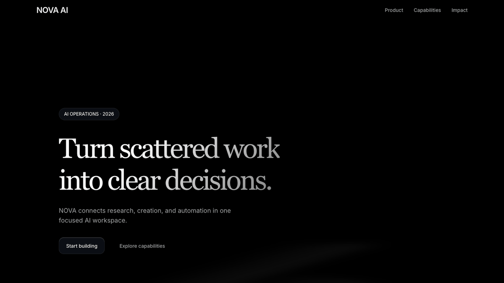</a></td><td><strong>Resend</strong><br>Sparse black editorial canvas, large serif hero, quiet gray navigation, inset dark actions, and barely visible diagonal light.<br><a href="references/resend-design-spec.md">English design spec</a> · <a href="https://mrmao007.github.io/awosome-frontend-styles/examples/resend.html">Live example</a></td></tr>
<tr><td width="38%"><a href="https://mrmao007.github.io/awosome-frontend-styles/examples/clerk.html">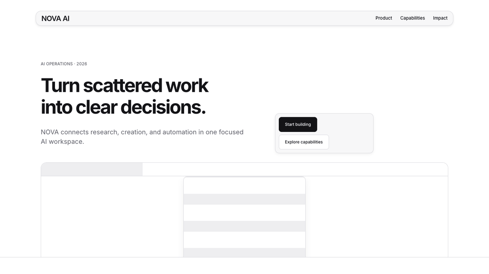</a></td><td><strong>Clerk</strong><br>Precise component showroom with floating gray navigation, bold black type, framed white UI geometry, and sparing violet states.<br><a href="references/clerk-design-spec.md">English design spec</a> · <a href="https://mrmao007.github.io/awosome-frontend-styles/examples/clerk.html">Live example</a></td></tr>
<tr><td width="38%"><a href="https://mrmao007.github.io/awosome-frontend-styles/examples/auth0.html"></a></td><td><strong>Auth0</strong><br>Deep plum navigation, coral-to-violet atmospheric hero, calm white typography, and translucent rectangular conversion and filter strips.<br><a href="references/auth0-design-spec.md">English design spec</a> · <a href="https://mrmao007.github.io/awosome-frontend-styles/examples/auth0.html">Live example</a></td></tr>
<tr><td width="38%"><a href="https://mrmao007.github.io/awosome-frontend-styles/examples/neon.html">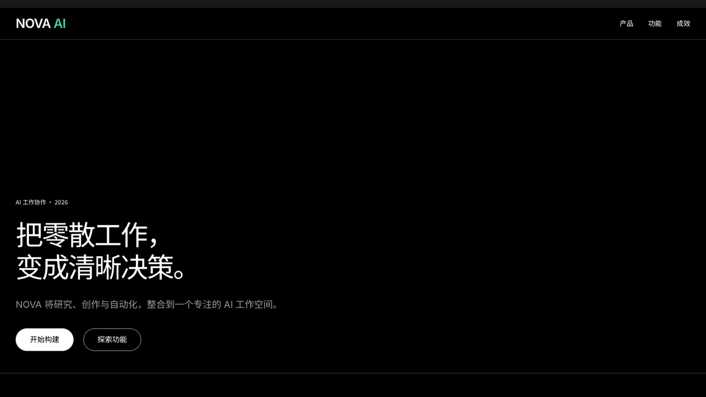</a></td><td><strong>Neon</strong><br>Stripped-back black canvas, low-anchored regular-weight hero, blank upper stage, square ruled sections, white pills, and selective green signals.<br><a href="references/neon-design-spec.md">English design spec</a> · <a href="https://mrmao007.github.io/awosome-frontend-styles/examples/neon.html">Live example</a></td></tr>
<tr><td width="38%"><a href="https://mrmao007.github.io/awosome-frontend-styles/examples/planetscale.html">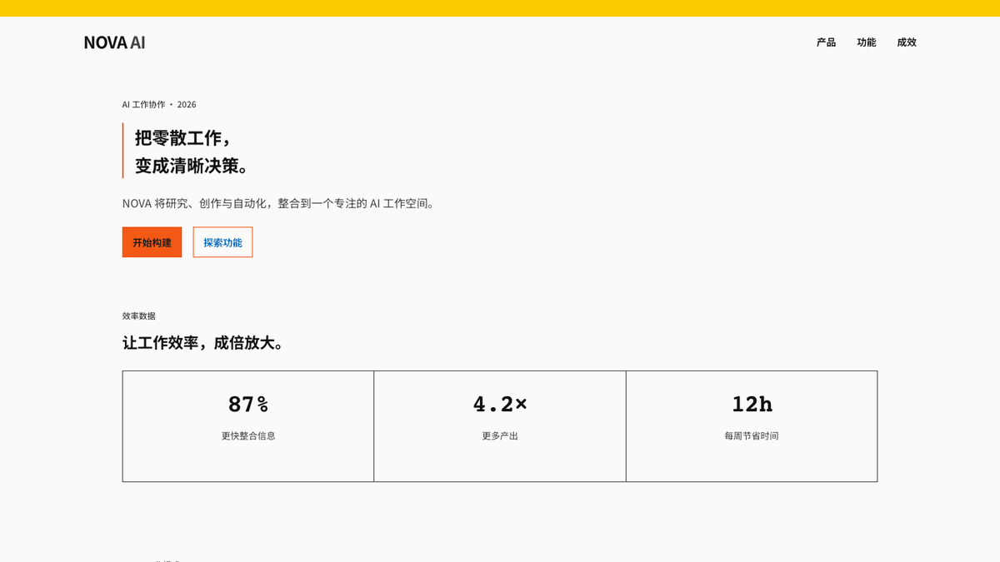</a></td><td><strong>PlanetScale</strong><br>Utilitarian monospace document layout, compact headline, graphite table rules, paper canvas, yellow bands, and rectangular orange actions.<br><a href="references/planetscale-design-spec.md">English design spec</a> · <a href="https://mrmao007.github.io/awosome-frontend-styles/examples/planetscale.html">Live example</a></td></tr>
<tr><td width="38%"><a href="https://mrmao007.github.io/awosome-frontend-styles/examples/upstash.html"></a></td><td><strong>Upstash</strong><br>Huge green-to-amber display, bright gray-white canvas, rounded service pavilion, tab tops, and washed-green capability tiles.<br><a href="references/upstash-design-spec.md">English design spec</a> · <a href="https://mrmao007.github.io/awosome-frontend-styles/examples/upstash.html">Live example</a></td></tr>
<tr><td width="38%"><a href="https://mrmao007.github.io/awosome-frontend-styles/examples/turso.html">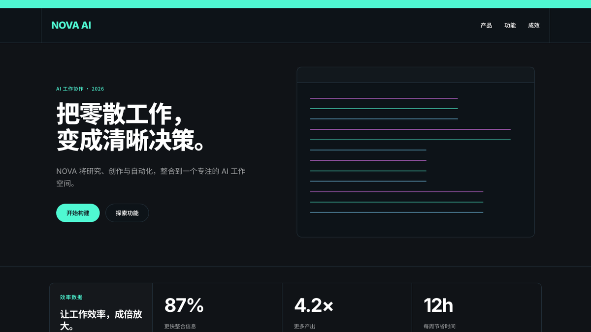</a></td><td><strong>Turso</strong><br>Dense dark architecture, aqua announcement rail, heavy split hero, abstract terminal pane, and segmented slate-bordered proof cells.<br><a href="references/turso-design-spec.md">English design spec</a> · <a href="https://mrmao007.github.io/awosome-frontend-styles/examples/turso.html">Live example</a></td></tr>
<tr><td width="38%"><a href="https://mrmao007.github.io/awosome-frontend-styles/examples/convex.html">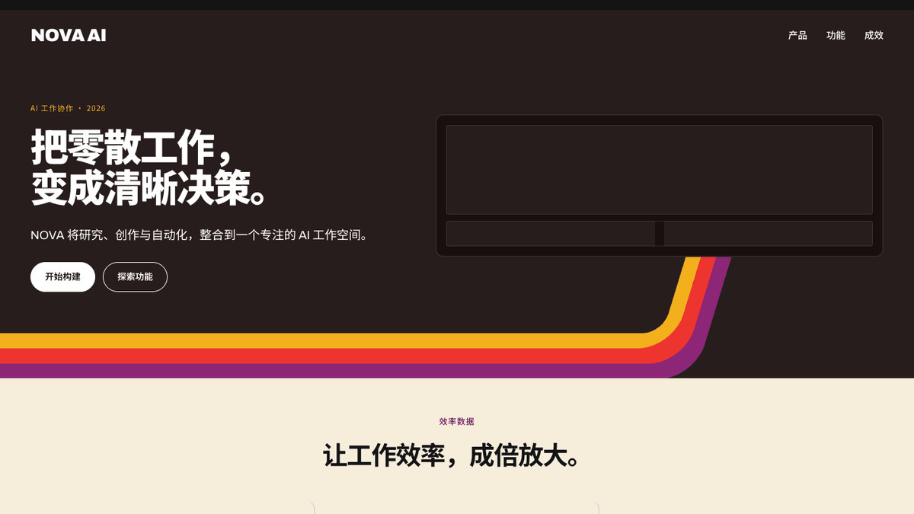</a></td><td><strong>Convex</strong><br>Retro-modern brown-black hero, extra-heavy white type, curved yellow-red-purple tracks, warm cream content, and contrasting feature cells.<br><a href="references/convex-design-spec.md">English design spec</a> · <a href="https://mrmao007.github.io/awosome-frontend-styles/examples/convex.html">Live example</a></td></tr>
<tr><td width="38%"><a href="https://mrmao007.github.io/awosome-frontend-styles/examples/appwrite.html">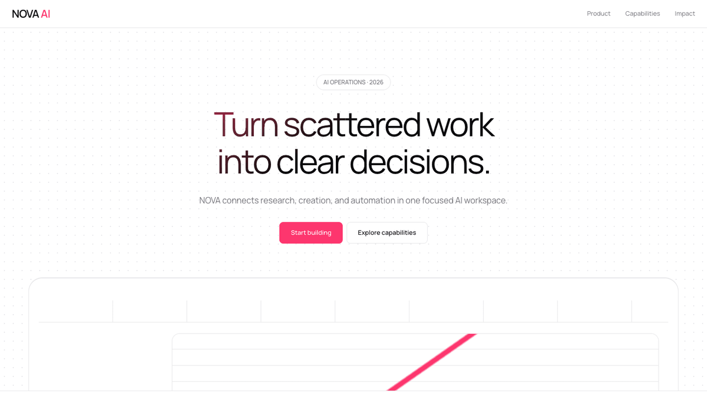</a></td><td><strong>Appwrite</strong><br>White dotted engineering canvas, light rose-to-black display, compact pink actions, broad dashboard geometry, and restrained service bento.<br><a href="references/appwrite-design-spec.md">English design spec</a> · <a href="https://mrmao007.github.io/awosome-frontend-styles/examples/appwrite.html">Live example</a></td></tr>
<tr><td width="38%"><a href="https://mrmao007.github.io/awosome-frontend-styles/examples/bun.html">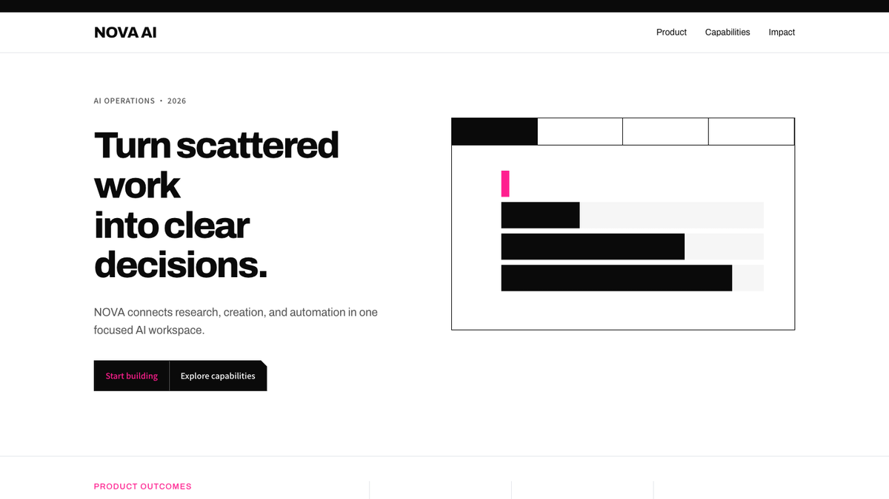</a></td><td><strong>Bun</strong><br>Heavy display on white, square benchmark geometry, clipped black action strip, ruled cells, and hot-pink signal edges.<br><a href="references/bun-design-spec.md">English design spec</a> · <a href="https://mrmao007.github.io/awosome-frontend-styles/examples/bun.html">Live example</a></td></tr>
<tr><td width="38%"><a href="https://mrmao007.github.io/awosome-frontend-styles/examples/astro.html">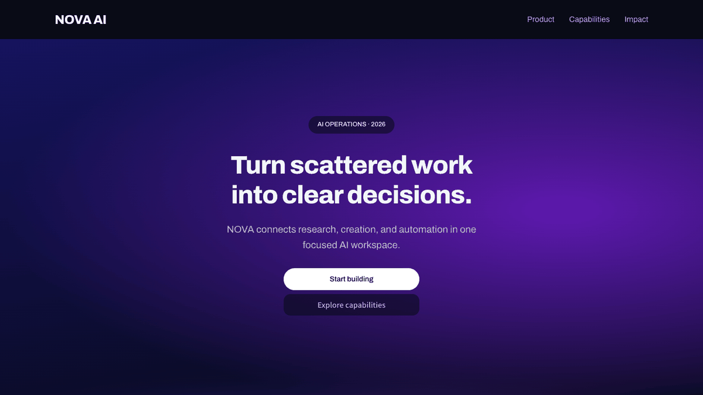</a></td><td><strong>Astro</strong><br>Centered bold display, indigo-violet atmosphere, stacked white and terminal-like actions, open proof strip, and lighter section headings.<br><a href="references/astro-design-spec.md">English design spec</a> · <a href="https://mrmao007.github.io/awosome-frontend-styles/examples/astro.html">Live example</a></td></tr>
</table>

</details>

<details>
<summary>AI Developer Tools — 1 styles</summary>

<table>
<tr><td width="38%"><a href="https://mrmao007.github.io/awosome-frontend-styles/examples/modalai.html">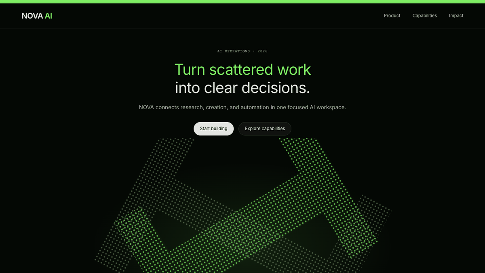</a></td><td><strong>Modal</strong><br>Black-green technical console, calm centered type, pale primary pills and a broad original crossed green particle field.<br><a href="references/modalai-design-spec.md">English design spec</a> · <a href="https://mrmao007.github.io/awosome-frontend-styles/examples/modalai.html">Live example</a></td></tr>
</table>

</details>

<details>
<summary>Finance &amp; Commerce — 10 styles</summary>

<table>
<tr><td width="38%"><a href="https://mrmao007.github.io/awosome-frontend-styles/examples/stripe.html">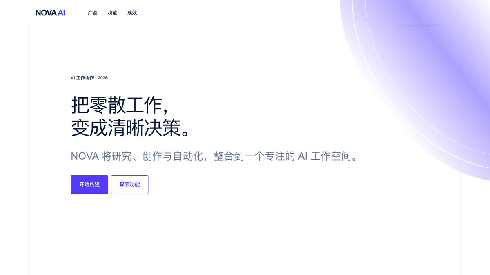</a></td><td><strong>Stripe</strong><br>Lightweight navy editorial typography, architectural rules, purple rectangular actions, and a sweeping diagonal color ribbon.<br><a href="references/stripe-design-spec.md">English design spec</a> · <a href="https://mrmao007.github.io/awosome-frontend-styles/examples/stripe.html">Live example</a></td></tr>
<tr><td width="38%"><a href="https://mrmao007.github.io/awosome-frontend-styles/examples/wise.html">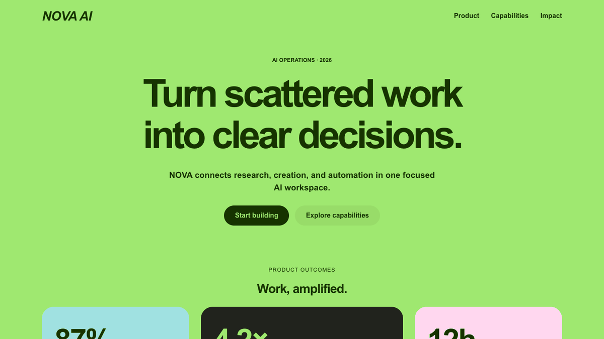</a></td><td><strong>Wise</strong><br>Acid-green canvas, compact heavy centered type, dark-green pills, and an unequal turquoise, dark, and pink shelf.<br><a href="references/wise-design-spec.md">English design spec</a> · <a href="https://mrmao007.github.io/awosome-frontend-styles/examples/wise.html">Live example</a></td></tr>
<tr><td width="38%"><a href="https://mrmao007.github.io/awosome-frontend-styles/examples/monzo.html">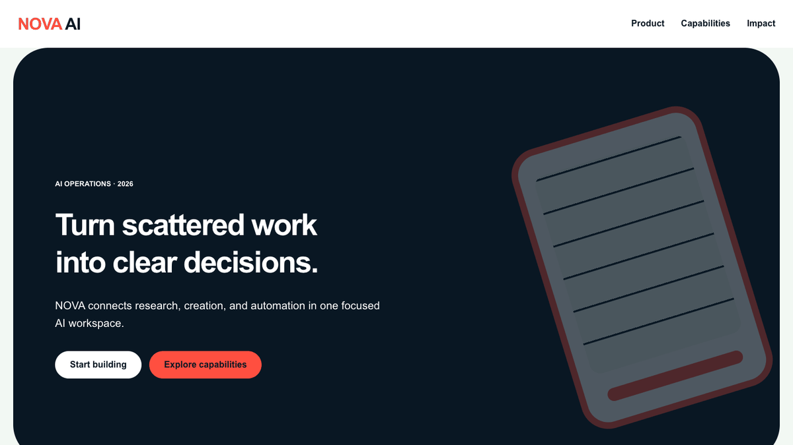</a></td><td><strong>Monzo</strong><br>Huge rounded navy inset hero, friendly heavy typography, coral emphasis, broad pills, and fresh pale-green surfaces.<br><a href="references/monzo-design-spec.md">English design spec</a> · <a href="https://mrmao007.github.io/awosome-frontend-styles/examples/monzo.html">Live example</a></td></tr>
<tr><td width="38%"><a href="https://mrmao007.github.io/awosome-frontend-styles/examples/mercury.html">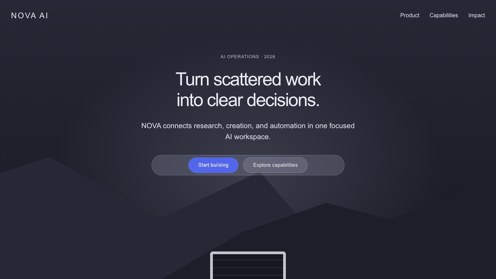</a></td><td><strong>Mercury</strong><br>Calm cinematic dark landscape, moderate centered typography, translucent capsule controls, cool blue actions, and quiet editorial continuation.<br><a href="references/mercury-design-spec.md">English design spec</a> · <a href="https://mrmao007.github.io/awosome-frontend-styles/examples/mercury.html">Live example</a></td></tr>
<tr><td width="38%"><a href="https://mrmao007.github.io/awosome-frontend-styles/examples/ramp.html">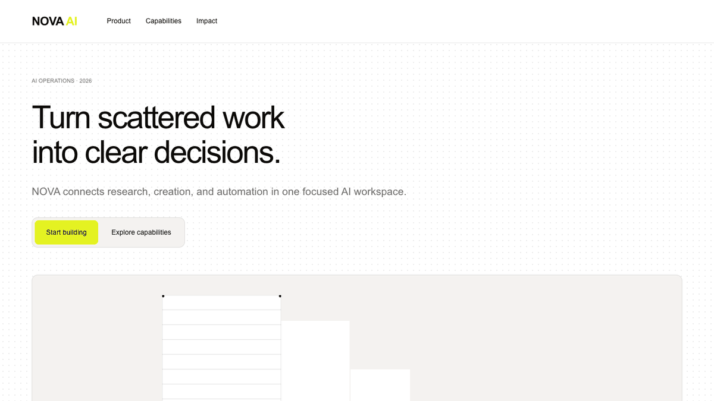</a></td><td><strong>Ramp</strong><br>Stippled white workbench, regular-weight left typography, flat lemon actions, layered documents, and registration-marked asymmetric inspection tiles.<br><a href="references/ramp-design-spec.md">English design spec</a> · <a href="https://mrmao007.github.io/awosome-frontend-styles/examples/ramp.html">Live example</a></td></tr>
<tr><td width="38%"><a href="https://mrmao007.github.io/awosome-frontend-styles/examples/robinhood.html">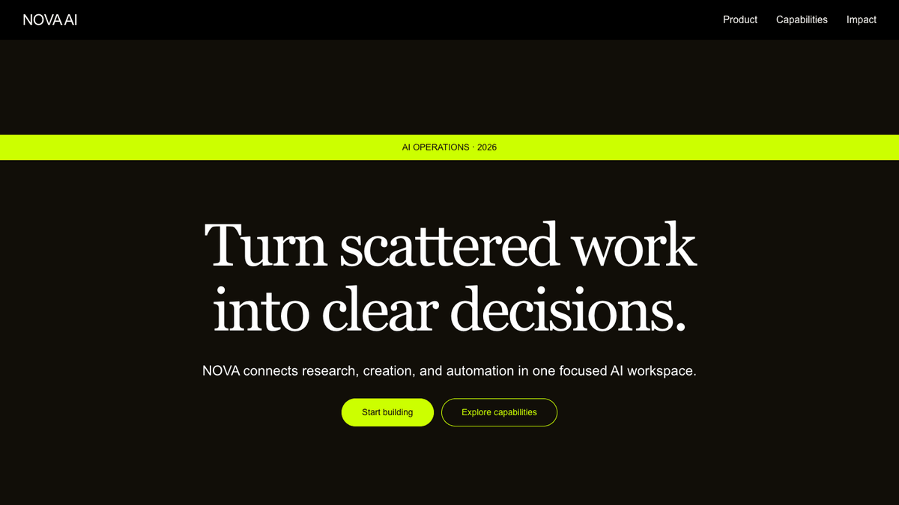</a></td><td><strong>Robinhood</strong><br>Monumental centered serif statements on warm black, neon chartreuse announcement bands, precise pills, and sparse ruled sections.<br><a href="references/robinhood-design-spec.md">English design spec</a> · <a href="https://mrmao007.github.io/awosome-frontend-styles/examples/robinhood.html">Live example</a></td></tr>
<tr><td width="38%"><a href="https://mrmao007.github.io/awosome-frontend-styles/examples/square.html">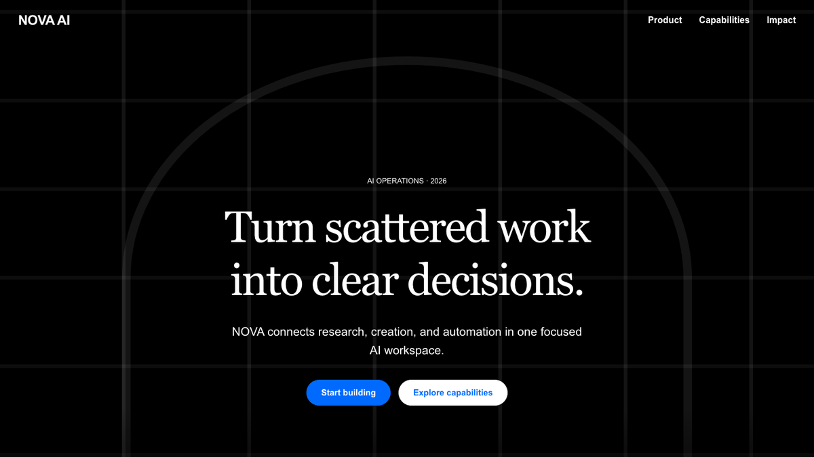</a></td><td><strong>Square</strong><br>Full-bleed black cinematic stage, centered serif-like display, blue and white capsules, and broad monochrome editorial strips.<br><a href="references/square-design-spec.md">English design spec</a> · <a href="https://mrmao007.github.io/awosome-frontend-styles/examples/square.html">Live example</a></td></tr>
<tr><td width="38%"><a href="https://mrmao007.github.io/awosome-frontend-styles/examples/shopify.html">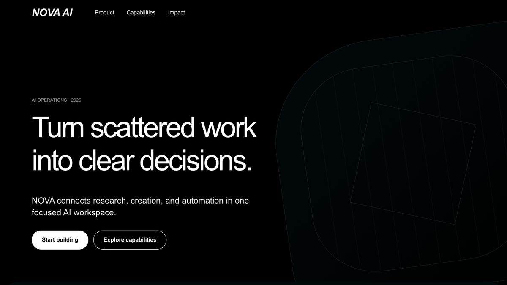</a></td><td><strong>Shopify</strong><br>Black cinematic hero, oversized light left-aligned typography, white pill actions, and rounded deep-green-black section shoulders.<br><a href="references/shopify-design-spec.md">English design spec</a> · <a href="https://mrmao007.github.io/awosome-frontend-styles/examples/shopify.html">Live example</a></td></tr>
<tr><td width="38%"><a href="https://mrmao007.github.io/awosome-frontend-styles/examples/mailchimp.html">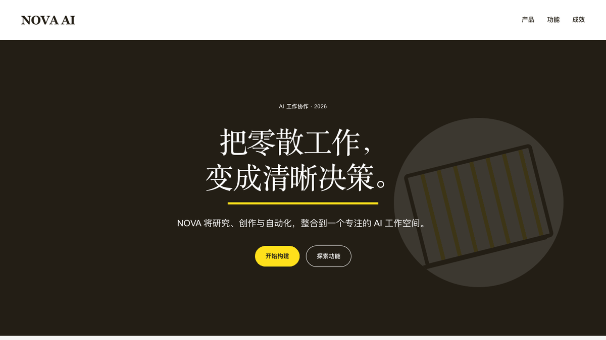</a></td><td><strong>Mailchimp</strong><br>Warm expressive serif editorial, centered dark hero, sunny yellow underline and pills, and approachable rounded recommendation panels.<br><a href="references/mailchimp-design-spec.md">English design spec</a> · <a href="https://mrmao007.github.io/awosome-frontend-styles/examples/mailchimp.html">Live example</a></td></tr>
<tr><td width="38%"><a href="https://mrmao007.github.io/awosome-frontend-styles/examples/intercom.html">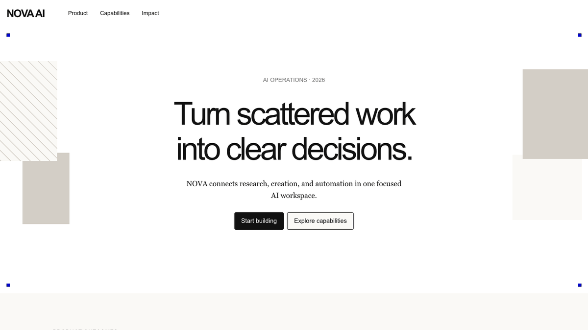</a></td><td><strong>Intercom</strong><br>Oversized light centered sans headline, serif supporting text, black rectangular actions, blue registration squares, and ruled ivory panels.<br><a href="references/intercom-design-spec.md">English design spec</a> · <a href="https://mrmao007.github.io/awosome-frontend-styles/examples/intercom.html">Live example</a></td></tr>
</table>

</details>

<details>
<summary>Consumer Products — 10 styles</summary>

<table>
<tr><td width="38%"><a href="https://mrmao007.github.io/awosome-frontend-styles/examples/apple.html">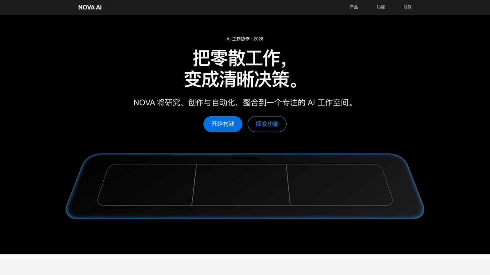</a></td><td><strong>Apple</strong><br>Centered product-monument stages, compact semibold titles, isolated oversized art, blue pill pairs, and crisp alternating dark/light fields.<br><a href="references/apple-design-spec.md">English design spec</a> · <a href="https://mrmao007.github.io/awosome-frontend-styles/examples/apple.html">Live example</a></td></tr>
<tr><td width="38%"><a href="https://mrmao007.github.io/awosome-frontend-styles/examples/ikea.html">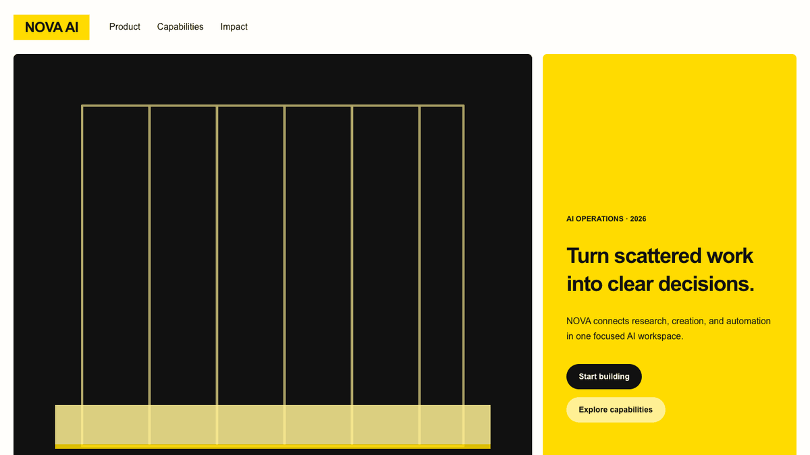</a></td><td><strong>IKEA</strong><br>Warm-white portal with a two-thirds media stage, yellow destination panel, shallow corners, practical black typography, and generous gutters.<br><a href="references/ikea-design-spec.md">English design spec</a> · <a href="https://mrmao007.github.io/awosome-frontend-styles/examples/ikea.html">Live example</a></td></tr>
<tr><td width="38%"><a href="https://mrmao007.github.io/awosome-frontend-styles/examples/sonos.html">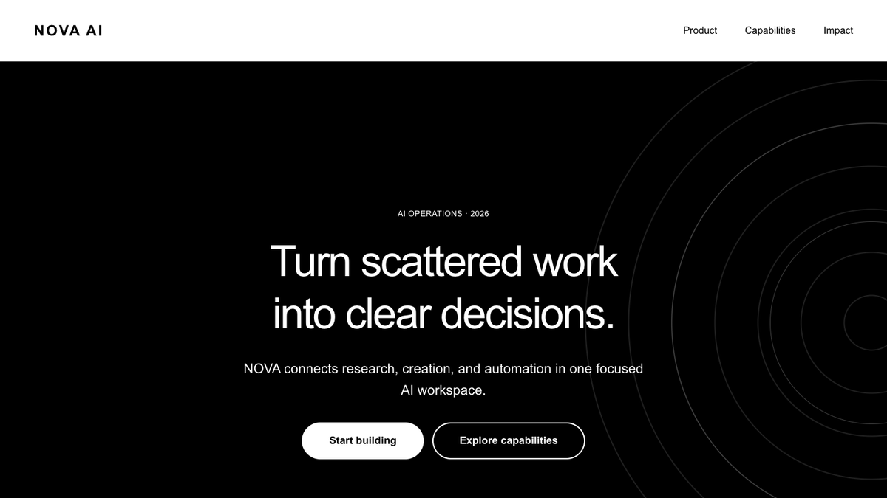</a></td><td><strong>Sonos</strong><br>Restrained monochrome cinema, large centered medium-weight statements, expansive wave geometry, broad outline capsules, and open editorial shelves.<br><a href="references/sonos-design-spec.md">English design spec</a> · <a href="https://mrmao007.github.io/awosome-frontend-styles/examples/sonos.html">Live example</a></td></tr>
<tr><td width="38%"><a href="https://mrmao007.github.io/awosome-frontend-styles/examples/oatly.html">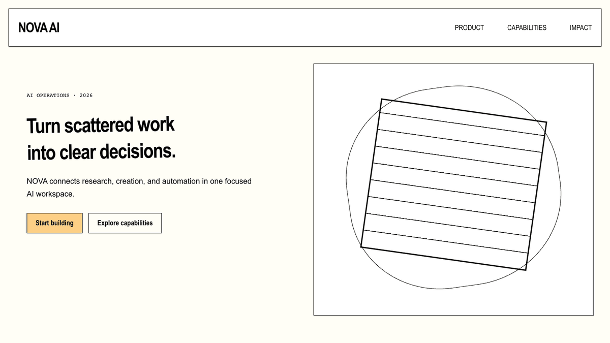</a></td><td><strong>Oatly</strong><br>Irreverent warm-paper newspaper grid, condensed display type, black rules, rough circles, unequal tiles, and sparse peach emphasis.<br><a href="references/oatly-design-spec.md">English design spec</a> · <a href="https://mrmao007.github.io/awosome-frontend-styles/examples/oatly.html">Live example</a></td></tr>
<tr><td width="38%"><a href="https://mrmao007.github.io/awosome-frontend-styles/examples/uber.html">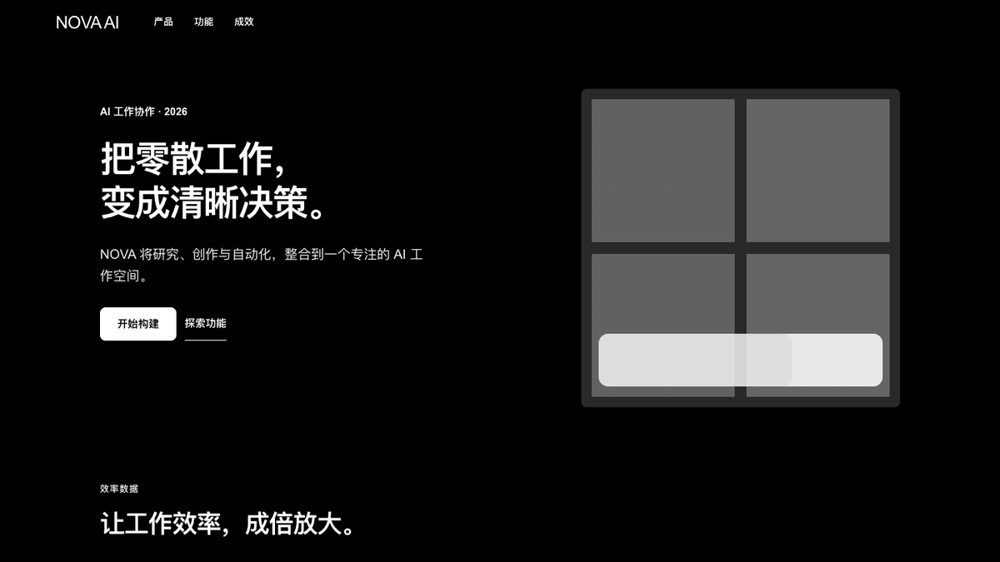</a></td><td><strong>Uber</strong><br>Practical black-first utility, bold left-aligned title, white actions, right-side collage, and compact dark suggestion tiles.<br><a href="references/uber-design-spec.md">English design spec</a> · <a href="https://mrmao007.github.io/awosome-frontend-styles/examples/uber.html">Live example</a></td></tr>
<tr><td width="38%"><a href="https://mrmao007.github.io/awosome-frontend-styles/examples/gopro.html">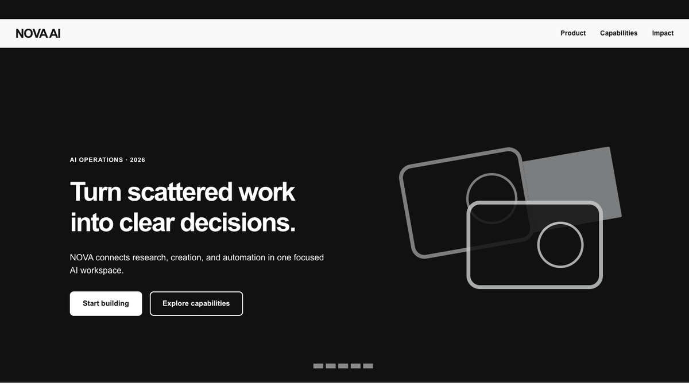</a></td><td><strong>GoPro</strong><br>Robust monochrome product stage, heavy left-aligned display, dark utility rail, hard modules, and passive segmented progress markers.<br><a href="references/gopro-design-spec.md">English design spec</a> · <a href="https://mrmao007.github.io/awosome-frontend-styles/examples/gopro.html">Live example</a></td></tr>
<tr><td width="38%"><a href="https://mrmao007.github.io/awosome-frontend-styles/examples/duolingo.html">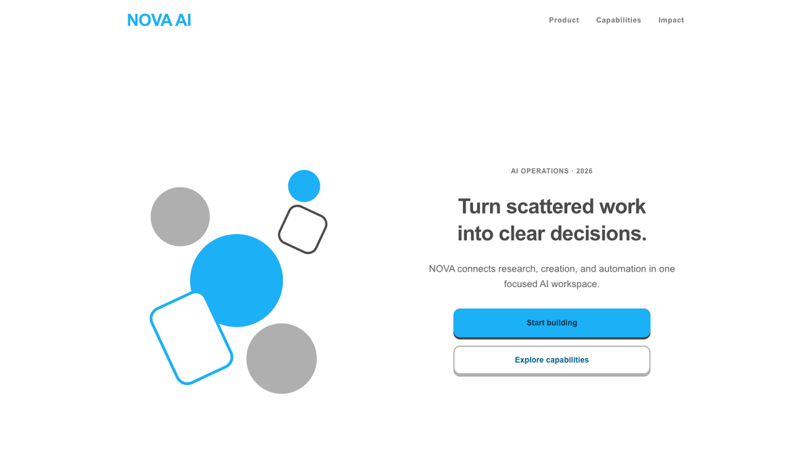</a></td><td><strong>Duolingo</strong><br>Friendly white canvas, compact heavy right-side title, floating abstract shapes, sky-blue emphasis, and stacked raised-edge controls.<br><a href="references/duolingo-design-spec.md">English design spec</a> · <a href="https://mrmao007.github.io/awosome-frontend-styles/examples/duolingo.html">Live example</a></td></tr>
<tr><td width="38%"><a href="https://mrmao007.github.io/awosome-frontend-styles/examples/headspace.html">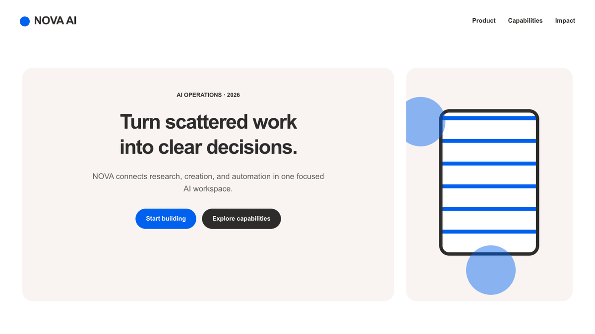</a></td><td><strong>Headspace</strong><br>Warm blush product shelves, compact heavy centered typography, unequal rounded stages, blue pills, and softly enclosed supporting modules.<br><a href="references/headspace-design-spec.md">English design spec</a> · <a href="https://mrmao007.github.io/awosome-frontend-styles/examples/headspace.html">Live example</a></td></tr>
<tr><td width="38%"><a href="https://mrmao007.github.io/awosome-frontend-styles/examples/oura.html">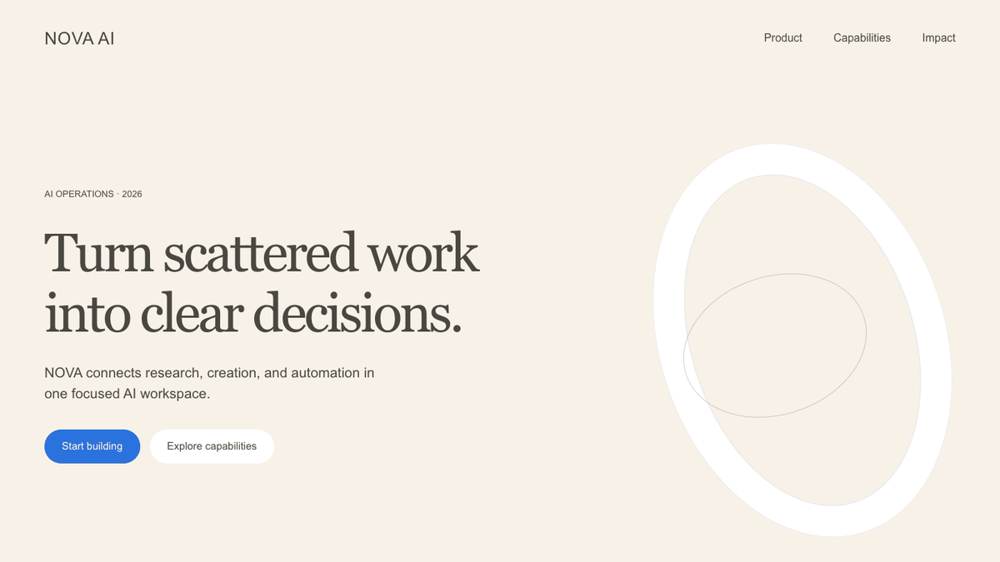</a></td><td><strong>Oura</strong><br>Warm cream editorial, slender left-aligned serif typography, restrained blue pills, overscaled orbit imagery, and quiet borderless continuation.<br><a href="references/oura-design-spec.md">English design spec</a> · <a href="https://mrmao007.github.io/awosome-frontend-styles/examples/oura.html">Live example</a></td></tr>
<tr><td width="38%"><a href="https://mrmao007.github.io/awosome-frontend-styles/examples/allbirds.html">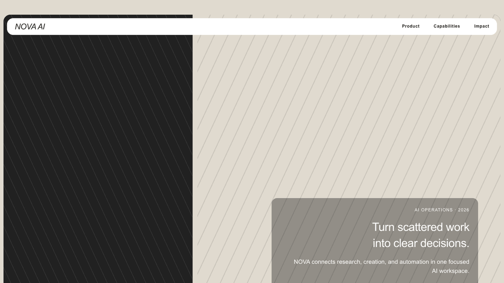</a></td><td><strong>Allbirds</strong><br>Neutral textile-like split hero, quiet lower-right typography, floating white navigation capsule, understated pills, and varied editorial tiles.<br><a href="references/allbirds-design-spec.md">English design spec</a> · <a href="https://mrmao007.github.io/awosome-frontend-styles/examples/allbirds.html">Live example</a></td></tr>
</table>

</details>

## Foundational style selection

| Style | Best suited for |
|---|---|
| Creative Mode | Creative portfolios and expressive product stories |
| BlockFrame | Maximalist candy neo-brutalism and energetic landing pages |
| Biennale Yellow | Exhibitions, cultural programs, and literary editorial |
| Blue Professional | Consulting, enterprise, finance, and executive dashboards |
| Bold Poster | Campaigns, launches, announcements, and magazine covers |
| Broadside | Manifestos, advocacy, and industrial editorial stories |
| Capsule | Lifestyle, beauty, fashion, wellness, and consumer products |
| Cartesian | Architecture, museums, premium editorial, and research narratives |
| Cobalt Grid | Technical reports, archives, datasets, and catalogues |
| Coral | Product launches, portfolios, event campaigns, and magazine stories |

## Capabilities

- Generates self-contained static HTML pages.
- Generates React pages and components that follow an existing project's conventions.
- Uses an explicit style when requested.
- Recommends a style from the content, audience, and desired tone when none is specified.
- Supports constrained hybrids when explicitly requested.
- Requires responsive and visual verification before delivery when the host provides browser tooling.
- Enforces accessibility basics and each style's explicit Do/Don't rules.

## Install with the universal Skills CLI

Interactive installation:

```bash
npx skills add MrMao007/awosome-frontend-styles
```

Preview the discovered skill without installing:

```bash
npx skills add MrMao007/awosome-frontend-styles --list
```

Install globally for all supported agents detected on the machine:

```bash
npx skills add MrMao007/awosome-frontend-styles --skill awosome-frontend-styles -g
```

Install into selected project-level agents:

```bash
npx skills add MrMao007/awosome-frontend-styles \
  --skill awosome-frontend-styles \
  -a claude-code \
  -a codex \
  -a cursor \
  -a github-copilot \
  -a gemini-cli \
  -a windsurf \
  -a opencode \
  -a qoder
```

Use `--copy -y` for CI, containers, or environments where symlinks are unsuitable.

## Manual installation paths

Clone this repository into a directory named `awosome-frontend-styles` under the host's skill root:

| Agent | Project-level path | User-level path |
|---|---|---|
| Claude Code | `.claude/skills/awosome-frontend-styles/` | `~/.claude/skills/awosome-frontend-styles/` |
| Codex CLI | `.agents/skills/awosome-frontend-styles/` | `~/.agents/skills/awosome-frontend-styles/` |
| Cursor | `.cursor/skills/awosome-frontend-styles/` or `.agents/skills/awosome-frontend-styles/` | `~/.cursor/skills/awosome-frontend-styles/` |
| GitHub Copilot | `.github/skills/awosome-frontend-styles/` or `.agents/skills/awosome-frontend-styles/` | `~/.copilot/skills/awosome-frontend-styles/` |
| Gemini CLI | `.gemini/skills/awosome-frontend-styles/` or `.agents/skills/awosome-frontend-styles/` | `~/.gemini/skills/awosome-frontend-styles/` |
| Windsurf / Devin | `.devin/skills/awosome-frontend-styles/`, `.windsurf/skills/awosome-frontend-styles/`, or `.agents/skills/awosome-frontend-styles/` | `~/.config/devin/skills/awosome-frontend-styles/` |
| OpenCode | `.opencode/skills/awosome-frontend-styles/` or `.agents/skills/awosome-frontend-styles/` | `~/.config/opencode/skills/awosome-frontend-styles/` |
| Qoder | `.qoder/skills/awosome-frontend-styles/` | `~/.qoder/skills/awosome-frontend-styles/` |
| QoderWork | — | `~/.qoderwork/skills/awosome-frontend-styles/` |

Example for QoderWork:

```bash
git clone https://github.com/MrMao007/awosome-frontend-styles.git ~/.qoderwork/skills/awosome-frontend-styles
```

Some hosts require a restart or skill reload after manual installation.

## Usage examples

```text
Create a product landing page in Capsule style as a self-contained HTML file.
```

```text
Restyle this React dashboard using Blue Professional. Keep the existing component architecture.
```

```text
Build an exhibition microsite. Recommend the most suitable bundled style and explain the choice briefly.
```

```text
Create a Coral landing page, borrowing only Cobalt Grid's pixel-stack chart atom.
```

```text
Create an Anthropic-inspired Chinese landing page. Keep my content and use the warm editorial preset.
```

```text
Restyle this React product page in the Vercel-inspired preset. Preserve all copy, data and interactions.
```

## Repository structure

```text
.
├── SKILL.md                      # Portable workflow; progressive disclosure
├── styles.json                   # 110 presets, tags and file paths
├── index.html                    # Searchable GitHub Pages gallery
├── references/
│   ├── STYLE_INDEX.md             # All 110 styles and selection guidance
│   └── <id>-design-spec.md        # 110 English specifications
├── examples/
│   ├── <id>.html                 # 110 runnable examples
│   └── <id>.png                  # 110 previews
├── scripts/validate.cjs          # Dependency-free integrity checks
├── CONTRIBUTING.md
├── LICENSE
└── NOTICE.md
```

`SKILL.md` contains the portable execution workflow. `references/STYLE_INDEX.md` selects the primary style, while each `*-design-spec.md` file contains the detailed visual contract.

## Portability rules

The frontmatter intentionally uses only portable fields: `name`, `description`, and `license`. The skill does not depend on vendor-specific hooks, tool allowlists, filesystem paths, or APIs. Each host may expose different browser and file tools; the workflow adapts to available capabilities.

## Design philosophy

**Atoms sacred, composition free.** Keep the selected preset's palette, typography, geometry, border/shadow language and constraints while adapting composition to the user's content. Product-inspired tokens are explicitly labeled as implementation choices, not unpublished official brand standards.

## Attribution

The ten foundational specifications are independently authored summaries of publicly accessible HyperFrames references. The 100 additional presets are independent studies of public product homepages, with source URLs and capture scope in each specification. HyperFrames, product names and trademarks belong to their respective owners. This repository is not affiliated with or endorsed by them.

Font names and font files remain subject to their respective licenses. This repository does not redistribute font binaries.

## License

MIT. See [LICENSE](LICENSE) and [NOTICE.md](NOTICE.md).
